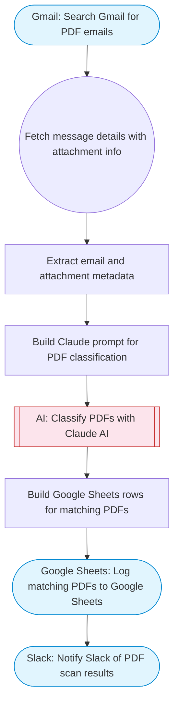

# Send PDF Attachments from Gmail to Google Drive with AI Filtering

Searches Gmail for emails with PDF attachments, uses Claude AI to classify which PDFs match a target criteria (invoices, contracts, etc.), and uploads matching attachments info to a Google Sheet for tracking with Slack notification.

> **Works with any AI agent.** Paste this page's URL into Claude Code, Codex, Cursor, Windsurf, OpenClaw, or any coding agent — it will read the docs, connect your platforms, and run this flow for you.

## Quick Start

```bash
# 1. Connect your platforms (one-time setup)
one add gmail
one add google-sheets
one add slack

# 2. Run the flow
one flow execute n8n-1897-gmail-pdf-to-drive \
  --input searchQuery="your question here" \
  --input filterCriteria="..." \
  --input spreadsheetId="..." \
  --input sheetName="..." \
  --input slackChannel="C01ABC123"
```

## Platforms

| Platform | Used for |
|----------|----------|
| Gmail | Reading emails |
| Google Sheets | Tracking |
| Slack | Notify Slack of PDF scan results |

> Don't have these connected yet? Run `one list` to check, then `one add <platform>` to connect.

## What it does

1. Search Gmail for PDF emails
2. Fetch message details with attachment info
3. Extract email and attachment metadata
4. Build Claude prompt for PDF classification
5. Classify PDFs with Claude AI
6. Log matching PDFs to Google Sheets
7. Notify Slack of PDF scan results

## Flow diagram



## Inputs

| Input | Required | Description |
|-------|----------|-------------|
| `searchQuery` | No | Gmail search query to find PDF emails (default: has:attachment filename:pdf newer_than:7d) |
| `filterCriteria` | No | What type of PDF attachments to filter for (default: invoices, receipts, or financial documents) |
| `spreadsheetId` | Yes | Google Sheets spreadsheet ID for attachment log |
| `sheetName` | No | Sheet tab name (default: PDF Attachments) |
| `slackChannel` | Yes | Slack channel for notification |

---

<sub>Based on [n8n #1897](https://n8n.io/workflows/1897) · 21.9K views on n8n · by [n8n-team](https://n8n.io/creators/n8n-team) · Converted to One CLI on 2026-03-25</sub>
