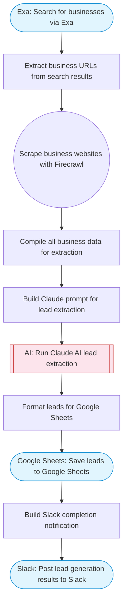

# Google Maps Business Lead Scraper

Searches for businesses via Exa, scrapes their websites with Firecrawl for contact details, uses Claude AI to extract and structure lead data (name, email, phone, address), and saves the leads to Google Sheets.

> **Works with any AI agent.** Paste this page's URL into Claude Code, Codex, Cursor, Windsurf, OpenClaw, or any coding agent — it will read the docs, connect your platforms, and run this flow for you.

## Quick Start

```bash
# 1. Connect your platforms (one-time setup)
one add exa
one add firecrawl
one add google-sheets
one add slack

# 2. Run the flow
one flow execute n8n-3443-google-maps-leads \
  --input slackChannel="C01ABC123" \
  --input businessType="..." \
  --input location="San Francisco" \
  --input sheetTitle="..."
```

## Platforms

| Platform | Used for |
|----------|----------|
| Exa | Business search |
| Firecrawl | Scraping business websites |
| Google Sheets | Saving leads |
| Slack | Completion notification |

> Don't have these connected yet? Run `one list` to check, then `one add <platform>` to connect.

## What it does

1. Search for businesses via Exa
2. Extract business URLs from search results
3. Scrape business websites with Firecrawl
4. Compile all business data for extraction
5. Build Claude prompt for lead extraction
6. Run Claude AI lead extraction
7. Format leads for Google Sheets
8. Save leads to Google Sheets
9. Build Slack completion notification
10. Post lead generation results to Slack

## Flow diagram



## Inputs

| Input | Required | Description |
|-------|----------|-------------|
| `slackChannel` | Yes | Slack channel for lead generation updates |
| `businessType` | Yes | Type of business to search for (e.g. 'plumbers', 'restaurants', 'dentists') |
| `location` | Yes | Location to search in (e.g. 'San Francisco, CA', 'New York City') |
| `sheetTitle` | No | Title for the Google Sheets spreadsheet (default: Business Leads) |

---

<sub>Based on [n8n #3443](https://n8n.io/workflows/3443) · 67.4K views on n8n · by [drfiras](https://n8n.io/creators/drfiras) · Converted to One CLI on 2026-03-25</sub>
