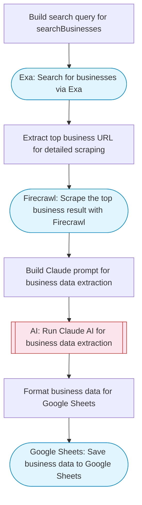

# Google Maps business scraper

Scrapes business data from Google Maps by searching via Exa for businesses in a location, scraping each result with Firecrawl for detailed info, using Claude to extract structured data (name, address, phone, hours, ratings), and saving everything to Google Sheets.

> **Works with any AI agent.** Paste this page's URL into Claude Code, Codex, Cursor, Windsurf, OpenClaw, or any coding agent — it will read the docs, connect your platforms, and run this flow for you.

## Quick Start

```bash
# 1. Connect your platforms (one-time setup)
one add exa
one add firecrawl
one add google-sheets

# 2. Run the flow
one flow execute n8n-2063-google-maps-scraper \
  --input searchQuery="your question here" \
  --input maxResults="10"
```

## Platforms

| Platform | Used for |
|----------|----------|
| Exa | Business search |
| Firecrawl | Scraping business pages |
| Google Sheets | Saving results |

> Don't have these connected yet? Run `one list` to check, then `one add <platform>` to connect.

## What it does

1. Build search query for searchBusinesses
2. Search for businesses via Exa
3. Extract top business URL for detailed scraping
4. Scrape the top business result with Firecrawl
5. Build Claude prompt for business data extraction
6. Run Claude AI for business data extraction
7. Format business data for Google Sheets
8. Save business data to Google Sheets

## Flow diagram



## Inputs

| Input | Required | Description |
|-------|----------|-------------|
| `searchQuery` | Yes | Business search query (e.g. 'coffee shops in San Francisco') |
| `maxResults` | No | Maximum number of businesses to scrape (default: 10) |

---

<sub>Based on [n8n #2063](https://n8n.io/workflows/2063) · 61.9K views on n8n · by [lucasperret](https://n8n.io/creators/lucasperret) · Converted to One CLI on 2026-03-25</sub>
