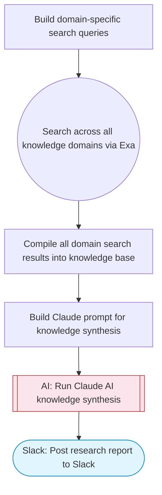

# Multi-Source Research Agent with Knowledge Synthesis

Takes a research question, queries multiple knowledge domains via Exa search, uses Claude AI to synthesize findings with cross-referencing like a GraphRAG knowledge base, and posts a comprehensive answer with sources to Slack. Adapted from n8n's InfraNodus GraphRAG chatbot agent.

> **Works with any AI agent.** Paste this page's URL into Claude Code, Codex, Cursor, Windsurf, OpenClaw, or any coding agent — it will read the docs, connect your platforms, and run this flow for you.

## Quick Start

```bash
# 1. Connect your platforms (one-time setup)
one add exa
one add slack

# 2. Run the flow
one flow execute n8n-4485-graphrag-research-agent \
  --input question="your question here" \
  --input domains="..." \
  --input slackChannel="C01ABC123"
```

## Platforms

| Platform | Used for |
|----------|----------|
| Exa | Multi-domain web search |
| Slack | Posting the synthesized answer |

> Don't have these connected yet? Run `one list` to check, then `one add <platform>` to connect.

## What it does

1. Build domain-specific search queries
2. Search across all knowledge domains via Exa
3. Compile all domain search results into knowledge base
4. Build Claude prompt for knowledge synthesis
5. Run Claude AI knowledge synthesis
6. Post research report to Slack

## Flow diagram



## Inputs

| Input | Required | Description |
|-------|----------|-------------|
| `question` | Yes | The research question to investigate across multiple knowledge domains |
| `domains` | No | Comma-separated knowledge domains to search (e.g. academic, industry, news, technical) (default: academic, industry, news) |
| `slackChannel` | Yes | Slack channel ID to post the research findings |

---

<sub>Based on [n8n #4485](https://n8n.io/workflows/4485) · 21.0K views on n8n · by [infranodus](https://n8n.io/creators/infranodus) · Converted to One CLI on 2026-03-25</sub>
