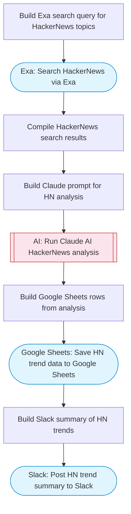

# HackerNews Trend Extractor & Report Generator

Fetches trending HackerNews discussions via Exa search, uses Claude AI to transform raw threads into human-readable insights, and saves a formatted report to Google Sheets. Adapted from n8n's HackerNews-to-Google-Docs workflow.

> **Works with any AI agent.** Paste this page's URL into Claude Code, Codex, Cursor, Windsurf, OpenClaw, or any coding agent — it will read the docs, connect your platforms, and run this flow for you.

## Quick Start

```bash
# 1. Connect your platforms (one-time setup)
one add exa
one add google-sheets
one add slack

# 2. Run the flow
one flow execute n8n-5677-hackernews-to-docs \
  --input spreadsheetId="..." \
  --input sheetName="..." \
  --input topics="your topic here" \
  --input slackChannel="C01ABC123"
```

## Platforms

| Platform | Used for |
|----------|----------|
| Exa | Searching hackernews |
| Google Sheets | Saving the report |
| Slack | Posting summary |

> Don't have these connected yet? Run `one list` to check, then `one add <platform>` to connect.

## What it does

1. Build Exa search query for HackerNews topics
2. Search HackerNews via Exa
3. Compile HackerNews search results
4. Build Claude prompt for HN analysis
5. Run Claude AI HackerNews analysis
6. Save HN trend data to Google Sheets
7. Post HN trend summary to Slack

## Flow diagram



## Inputs

| Input | Required | Description |
|-------|----------|-------------|
| `spreadsheetId` | Yes | Google Sheets spreadsheet ID to save the report |
| `sheetName` | No | Sheet tab name for the report (default: HN Trends) |
| `topics` | No | Comma-separated topics to search for on HackerNews (default: AI, programming, startups, tech industry) |
| `slackChannel` | Yes | Slack channel ID to post the summary |

---

<sub>Based on [n8n #5677](https://n8n.io/workflows/5677) · 21.5K views on n8n · by [ranjancse](https://n8n.io/creators/ranjancse) · Converted to One CLI on 2026-03-25</sub>
