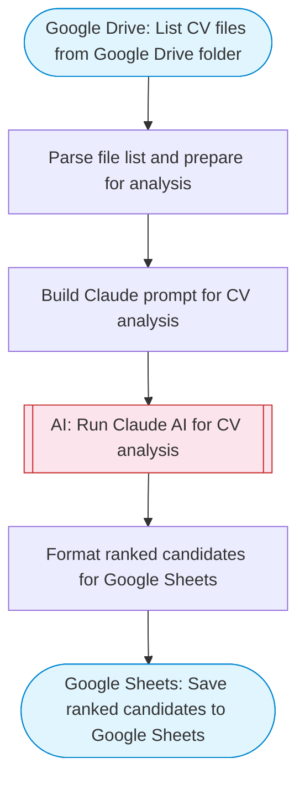

# HR CV analyzer and candidate ranker

Automates HR CV analysis by listing files from a Google Drive folder, using Claude to analyze and rank candidates based on job requirements, and saving the ranked results with scores to Google Sheets.

> **Works with any AI agent.** Paste this page's URL into Claude Code, Codex, Cursor, Windsurf, OpenClaw, or any coding agent — it will read the docs, connect your platforms, and run this flow for you.

## Quick Start

```bash
# 1. Connect your platforms (one-time setup)
one add google-drive
one add google-sheets

# 2. Run the flow
one flow execute n8n-8234-hr-cv-analysis \
  --input folderId="..." \
  --input jobTitle="..." \
  --input jobRequirements="..."
```

## Platforms

| Platform | Used for |
|----------|----------|
| Google Drive | Listing files |
| Google Sheets | Saving results |

> Don't have these connected yet? Run `one list` to check, then `one add <platform>` to connect.

## What it does

1. List CV files from Google Drive folder
2. Parse file list and prepare for analysis
3. Build Claude prompt for CV analysis
4. Run Claude AI for CV analysis
5. Format ranked candidates for Google Sheets
6. Save ranked candidates to Google Sheets

## Flow diagram



## Inputs

| Input | Required | Description |
|-------|----------|-------------|
| `folderId` | Yes | Google Drive folder ID containing CV/resume files |
| `jobTitle` | Yes | Job title to evaluate candidates against (e.g. 'Senior Frontend Engineer') |
| `jobRequirements` | Yes | Key job requirements (e.g. 'React, TypeScript, 5+ years experience, team leadership') |

---

<sub>Based on [n8n #8234](https://n8n.io/workflows/8234) · 65.6K views on n8n · by [praneel7015](https://n8n.io/creators/praneel7015) · Converted to One CLI on 2026-03-25</sub>
