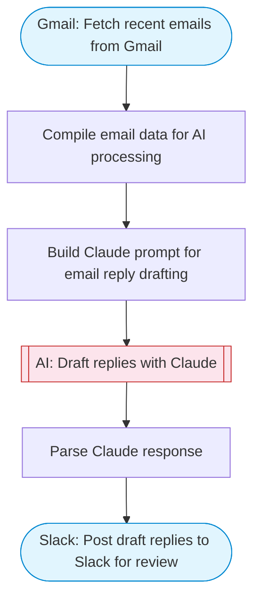

# Human-in-the-Loop Email Responder

Fetch recent emails from Gmail, use Claude AI to draft replies, and post the drafts to Slack for human review before sending. A simple but effective email triage and response system.

> **Works with any AI agent.** Paste this page's URL into Claude Code, Codex, Cursor, Windsurf, OpenClaw, or any coding agent — it will read the docs, connect your platforms, and run this flow for you.

## Quick Start

```bash
# 1. Connect your platforms (one-time setup)
one add gmail
one add slack

# 2. Run the flow
one flow execute n8n-2907-human-loop-email \
  --input slackChannel="C01ABC123" \
  --input maxEmails="user@example.com" \
  --input emailLabel="user@example.com" \
  --input replyTone="..."
```

## Platforms

| Platform | Used for |
|----------|----------|
| Gmail | Listing emails |
| Slack | Post draft replies to Slack for review |

> Don't have these connected yet? Run `one list` to check, then `one add <platform>` to connect.

## What it does

1. Fetch recent emails from Gmail
2. Compile email data for AI processing
3. Build Claude prompt for email reply drafting
4. Draft replies with Claude
5. Parse Claude response
6. Post draft replies to Slack for review

## Flow diagram



## Inputs

| Input | Required | Description |
|-------|----------|-------------|
| `slackChannel` | Yes | Slack channel ID to post draft replies for review |
| `maxEmails` | No | Maximum number of recent emails to process (default: 5) |
| `emailLabel` | No | Gmail label to filter emails (e.g. INBOX, UNREAD) (default: INBOX) |
| `replyTone` | No | Tone for drafted replies (e.g. 'formal', 'casual', 'professional and friendly') (default: professional and friendly) |

---

<sub>Based on [n8n #2907](https://n8n.io/workflows/2907) · 33.2K views on n8n · by [n3witalia](https://n8n.io/creators/n3witalia) · Converted to One CLI on 2026-03-25</sub>
