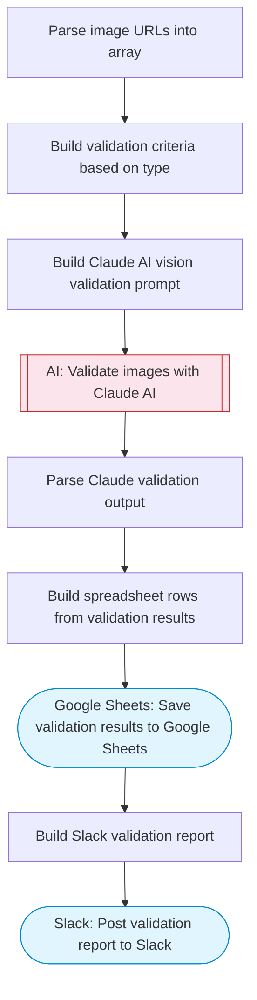

# Automate image validation tasks using AI vision

Downloads images from Google Drive, uses Claude AI vision to validate each image against specified criteria (passport photos, product images, document scans), logs validation results to Google Sheets, and reports to Slack with pass/fail status.

> **Works with any AI agent.** Paste this page's URL into Claude Code, Codex, Cursor, Windsurf, OpenClaw, or any coding agent — it will read the docs, connect your platforms, and run this flow for you.

## Quick Start

```bash
# 1. Connect your platforms (one-time setup)
one add google-drive
one add google-sheets
one add slack

# 2. Run the flow
one flow execute n8n-2420-image-validation-ai \
  --input imageUrls="https://example.com" \
  --input validationType="..." \
  --input validationCriteria="..." \
  --input slackChannel="C01ABC123"
```

## Platforms

| Platform | Used for |
|----------|----------|
| Google Drive | Listing image files |
| Google Sheets | Validation results |
| Slack | Notifications |

> Don't have these connected yet? Run `one list` to check, then `one add <platform>` to connect.

## What it does

1. Parse image URLs into array
2. Build validation criteria based on type
3. Build Claude AI vision validation prompt
4. Validate images with Claude AI
5. Parse Claude validation output
6. Build spreadsheet rows from validation results
7. Save validation results to Google Sheets
8. Build Slack validation report
9. Post validation report to Slack

## Flow diagram



## Inputs

| Input | Required | Description |
|-------|----------|-------------|
| `imageUrls` | Yes | Comma-separated list of image URLs to validate |
| `validationType` | No | Type: passport_photo, product_image, document_scan, id_card, general (default: general) |
| `validationCriteria` | No | Custom validation criteria (e.g. 'must show a wine bottle label clearly') (default: ) |
| `slackChannel` | Yes | Slack channel for validation results |

---

<sub>Based on [n8n #2420](https://n8n.io/workflows/2420) · 26.6K views on n8n · by [jimleuk](https://n8n.io/creators/jimleuk) · Converted to One CLI on 2026-03-25</sub>
