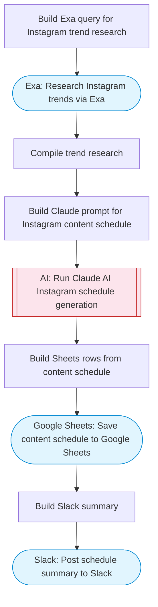

# Instagram Content Schedule Generator

Reads content strategy inputs and blog post data from Google Sheets, researches trending topics via Exa, uses Claude AI to generate a complete Instagram content schedule with captions and hashtags, and saves the schedule back to Sheets with a summary to Slack. Adapted from n8n's Instagram content schedule with GPT-4 and Apify.

> **Works with any AI agent.** Paste this page's URL into Claude Code, Codex, Cursor, Windsurf, OpenClaw, or any coding agent — it will read the docs, connect your platforms, and run this flow for you.

## Quick Start

```bash
# 1. Connect your platforms (one-time setup)
one add google-sheets
one add exa
one add slack

# 2. Run the flow
one flow execute n8n-6977-instagram-content-schedule \
  --input spreadsheetId="..." \
  --input slackChannel="C01ABC123" \
  --input brandName="..." \
  --input contentPillars="..." \
  --input postsPerWeek="..." \
  --input targetAudience="..."
```

## Platforms

| Platform | Used for |
|----------|----------|
| Google Sheets | Connection key |
| Exa | Trend research |
| Slack | Posting summary |

> Don't have these connected yet? Run `one list` to check, then `one add <platform>` to connect.

## What it does

1. Build Exa query for Instagram trend research
2. Research Instagram trends via Exa
3. Compile trend research
4. Build Claude prompt for Instagram content schedule
5. Run Claude AI Instagram schedule generation
6. Save content schedule to Google Sheets
7. Post schedule summary to Slack

## Flow diagram



## Inputs

| Input | Required | Description |
|-------|----------|-------------|
| `spreadsheetId` | Yes | Google Sheets spreadsheet ID (used for reading inputs and saving schedule) |
| `slackChannel` | Yes | Slack channel for summary |
| `brandName` | Yes | Brand or business name for personalized content |
| `contentPillars` | No | Comma-separated content pillars for the brand (default: educational, behind-the-scenes, promotional, community, entertaining) |
| `postsPerWeek` | No | Number of Instagram posts to schedule per week (default: 5) |
| `targetAudience` | No | Target audience description (default: ) |

---

<sub>Based on [n8n #6977](https://n8n.io/workflows/6977) · 20.4K views on n8n · by [keisha](https://n8n.io/creators/keisha) · Converted to One CLI on 2026-03-25</sub>
