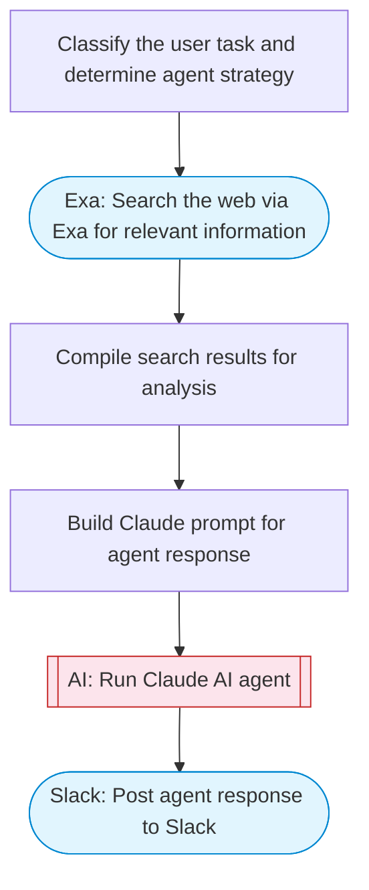

# Interactive AI agent with chat and tools

An AI agent with a chat interface. Takes a user question, searches the web via Exa for real-time information, uses Claude to synthesize a comprehensive answer with tool-like capabilities, and delivers the result to Slack with rich Block Kit formatting.

> **Works with any AI agent.** Paste this page's URL into Claude Code, Codex, Cursor, Windsurf, OpenClaw, or any coding agent — it will read the docs, connect your platforms, and run this flow for you.

## Quick Start

```bash
# 1. Connect your platforms (one-time setup)
one add exa
one add slack

# 2. Run the flow
one flow execute n8n-5819-interactive-agent-chat \
  --input question="your question here" \
  --input slackChannel="C01ABC123" \
  --input agentMode="..."
```

## Platforms

| Platform | Used for |
|----------|----------|
| Exa | Web search |
| Slack | Posting results |

> Don't have these connected yet? Run `one list` to check, then `one add <platform>` to connect.

## What it does

1. Classify the user task and determine agent strategy
2. Search the web via Exa for relevant information
3. Compile search results for analysis
4. Build Claude prompt for agent response
5. Run Claude AI agent
6. Post agent response to Slack

## Flow diagram



## Inputs

| Input | Required | Description |
|-------|----------|-------------|
| `question` | Yes | The user question or task for the AI agent |
| `slackChannel` | Yes | Slack channel ID to post the response |
| `agentMode` | No | Agent mode: research (web search + analysis), calculate (math/logic), create (content generation) (default: research) |

---

<sub>Based on [n8n #5819](https://n8n.io/workflows/5819) · 57.4K views on n8n · by [lucaspeyrin](https://n8n.io/creators/lucaspeyrin) · Converted to One CLI on 2026-03-25</sub>
