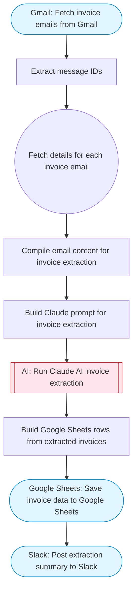

# AI Invoice Data Extractor

Fetches emails from Gmail that contain invoices, uses Claude AI to extract structured data (amounts, dates, vendors, line items) from the email content, and saves the extracted invoice data to Google Sheets. Adapted from n8n's LlamaParse invoice extraction workflow.

> **Works with any AI agent.** Paste this page's URL into Claude Code, Codex, Cursor, Windsurf, OpenClaw, or any coding agent — it will read the docs, connect your platforms, and run this flow for you.

## Quick Start

```bash
# 1. Connect your platforms (one-time setup)
one add gmail
one add google-sheets
one add slack

# 2. Run the flow
one flow execute n8n-2320-invoice-extractor \
  --input spreadsheetId="..." \
  --input sheetName="..." \
  --input slackChannel="C01ABC123" \
  --input searchQuery="your question here" \
  --input maxEmails="user@example.com"
```

## Platforms

| Platform | Used for |
|----------|----------|
| Gmail | Fetching invoice emails |
| Google Sheets | Saving extracted data |
| Slack | Posting extraction summary |

> Don't have these connected yet? Run `one list` to check, then `one add <platform>` to connect.

## What it does

1. Fetch invoice emails from Gmail
2. Extract message IDs
3. Fetch details for each invoice email
4. Compile email content for invoice extraction
5. Build Claude prompt for invoice extraction
6. Run Claude AI invoice extraction
7. Save invoice data to Google Sheets
8. Post extraction summary to Slack

## Flow diagram



## Inputs

| Input | Required | Description |
|-------|----------|-------------|
| `spreadsheetId` | Yes | Google Sheets spreadsheet ID to save invoice data |
| `sheetName` | No | Sheet/tab name within the spreadsheet (default: Invoices) (default: Invoices) |
| `slackChannel` | Yes | Slack channel ID to post the extraction summary |
| `searchQuery` | No | Gmail search query for finding invoice emails (default: subject:(invoice OR receipt OR payment) newer_than:7d) |
| `maxEmails` | No | Maximum number of emails to process (default: 10) (default: 10) |

---

<sub>Based on [n8n #2320](https://n8n.io/workflows/2320) · 45.6K views on n8n · by [jimleuk](https://n8n.io/creators/jimleuk) · Converted to One CLI on 2026-03-25</sub>
