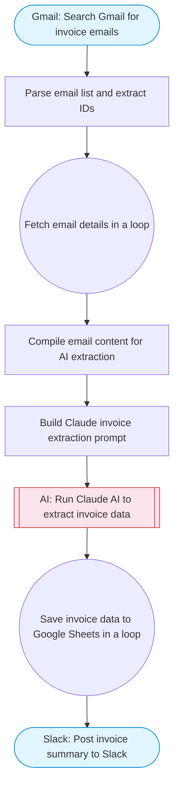

# Invoice Gmail to Sheets — Search Gmail, Claude extracts data, save to Sheets

Searches Gmail for invoice emails, uses Claude AI to extract invoice data (amounts, dates, vendors, line items), and saves the structured data to Google Sheets for reconciliation tracking.

> **Works with any AI agent.** Paste this page's URL into Claude Code, Codex, Cursor, Windsurf, OpenClaw, or any coding agent — it will read the docs, connect your platforms, and run this flow for you.

## Quick Start

```bash
# 1. Connect your platforms (one-time setup)
one add gmail
one add gmail
one add google-sheets
one add slack

# 2. Run the flow
one flow execute n8n-3016-invoice-gmail-to-sheets \
  --input slackChannel="C01ABC123" \
  --input spreadsheetUrl="https://example.com" \
  --input sheetName="..." \
  --input gmailQuery="your question here" \
  --input maxEmails="user@example.com"
```

## Platforms

| Platform | Used for |
|----------|----------|
| Gmail | Listing emails |
| Gmail | Getting email details |
| Google Sheets | Saving invoice data |
| Slack | Notifications |

> Don't have these connected yet? Run `one list` to check, then `one add <platform>` to connect.

## What it does

1. Search Gmail for invoice emails
2. Parse email list and extract IDs
3. Fetch email details in a loop
4. Compile email content for AI extraction
5. Build Claude invoice extraction prompt
6. Run Claude AI to extract invoice data
7. Save invoice data to Google Sheets in a loop
8. Post invoice summary to Slack

## Flow diagram



## Inputs

| Input | Required | Description |
|-------|----------|-------------|
| `slackChannel` | Yes | Slack channel ID for invoice processing notifications |
| `spreadsheetUrl` | Yes | Google Sheets URL for invoice tracking (columns: Date, Vendor, InvoiceNumber, Amount, Currency, DueDate, Status) |
| `sheetName` | No | Sheet tab name for invoice data (default: Sheet1) |
| `gmailQuery` | No | Gmail search query to find invoice emails (default: subject:(invoice OR receipt OR billing) has:attachment newer_than:7d) |
| `maxEmails` | No | Maximum number of emails to process (default: 10) |

---

<sub>Based on [n8n #3016](https://n8n.io/workflows/3016) · 38.2K views on n8n · by [carlosgracia](https://n8n.io/creators/carlosgracia) · Converted to One CLI on 2026-03-25</sub>
