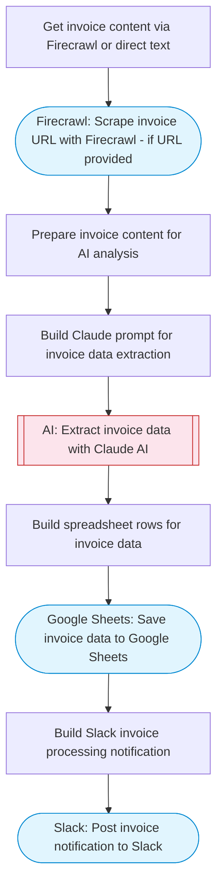

# Automated invoice processing with AI OCR and Google Sheets

Processes invoice documents by scraping content with Firecrawl or accepting text input, uses Claude AI to extract structured invoice data (vendor, amounts, line items), logs everything to Google Sheets, and sends a confirmation summary to Slack.

> **Works with any AI agent.** Paste this page's URL into Claude Code, Codex, Cursor, Windsurf, OpenClaw, or any coding agent — it will read the docs, connect your platforms, and run this flow for you.

## Quick Start

```bash
# 1. Connect your platforms (one-time setup)
one add firecrawl
one add google-sheets
one add slack

# 2. Run the flow
one flow execute n8n-4849-invoice-processing \
  --input invoiceUrl="https://example.com" \
  --input invoiceText="..." \
  --input slackChannel="C01ABC123" \
  --input spreadsheetName="..."
```

## Platforms

| Platform | Used for |
|----------|----------|
| Firecrawl | Invoice url scraping |
| Google Sheets | Invoice logging |
| Slack | Processing notifications |

> Don't have these connected yet? Run `one list` to check, then `one add <platform>` to connect.

## What it does

1. Get invoice content via Firecrawl or direct text
2. Scrape invoice URL with Firecrawl (if URL provided)
3. Prepare invoice content for AI analysis
4. Build Claude prompt for invoice data extraction
5. Extract invoice data with Claude AI
6. Build spreadsheet rows for invoice data
7. Save invoice data to Google Sheets
8. Build Slack invoice processing notification
9. Post invoice notification to Slack

## Flow diagram



## Inputs

| Input | Required | Description |
|-------|----------|-------------|
| `invoiceUrl` | No | URL of the invoice document to process (default: ) |
| `invoiceText` | No | Raw invoice text if not using URL (paste invoice content) (default: ) |
| `slackChannel` | Yes | Slack channel for invoice processing notifications |
| `spreadsheetName` | No | Name for the Google Sheets spreadsheet (default: Invoice Processing Log) |

---

<sub>Based on [n8n #4849](https://n8n.io/workflows/4849) · 27.5K views on n8n · by [raquelgiugliano](https://n8n.io/creators/raquelgiugliano) · Converted to One CLI on 2026-03-25</sub>
