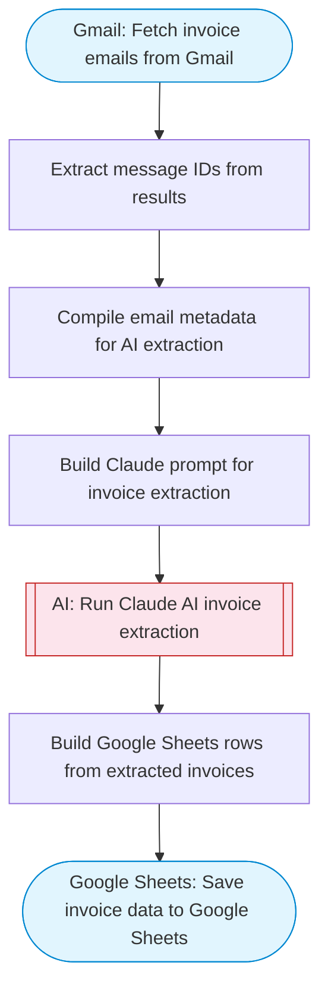

# Invoice processor and extractor with AI

Fetches invoice emails from Gmail, Claude AI extracts structured data including amounts, dates, vendors, invoice numbers, and line items, then saves all extracted invoice data to Google Sheets. Adapted from n8n's OCR AI invoice processor and validator workflow.

> **Works with any AI agent.** Paste this page's URL into Claude Code, Codex, Cursor, Windsurf, OpenClaw, or any coding agent — it will read the docs, connect your platforms, and run this flow for you.

## Quick Start

```bash
# 1. Connect your platforms (one-time setup)
one add gmail
one add google-sheets

# 2. Run the flow
one flow execute n8n-198-invoice-processor \
  --input spreadsheetId="..." \
  --input sheetName="..." \
  --input searchQuery="your question here" \
  --input maxEmails="user@example.com"
```

## Platforms

| Platform | Used for |
|----------|----------|
| Gmail | Fetching invoice emails |
| Google Sheets | Saving extracted data |

> Don't have these connected yet? Run `one list` to check, then `one add <platform>` to connect.

## What it does

1. Fetch invoice emails from Gmail
2. Extract message IDs from results
3. Compile email metadata for AI extraction
4. Build Claude prompt for invoice extraction
5. Run Claude AI invoice extraction
6. Save invoice data to Google Sheets

## Flow diagram



## Inputs

| Input | Required | Description |
|-------|----------|-------------|
| `spreadsheetId` | Yes | Google Sheets spreadsheet ID to save invoice data |
| `sheetName` | No | Sheet tab name for invoice data (default: Invoices) |
| `searchQuery` | No | Gmail search query for finding invoice emails (default: subject:(invoice OR receipt OR payment OR billing) newer_than:7d) |
| `maxEmails` | No | Maximum number of emails to process (default: 15) (default: 15) |

---

<sub>Based on [n8n #198](https://n8n.io/workflows/198) · 31.1K views on n8n · Converted to One CLI on 2026-03-25</sub>
