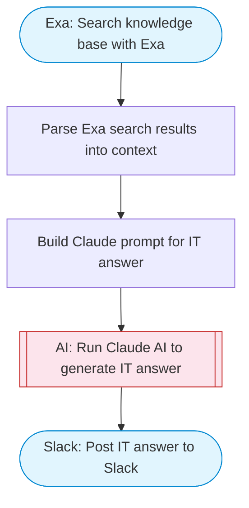

# IT Ops Slack Bot — Exa Knowledge Base + Claude Answers

Takes an IT question, searches a knowledge base using Exa for relevant documentation and solutions, uses Claude AI to synthesize an expert answer, and posts the response to Slack with Block Kit formatting.

> **Works with any AI agent.** Paste this page's URL into Claude Code, Codex, Cursor, Windsurf, OpenClaw, or any coding agent — it will read the docs, connect your platforms, and run this flow for you.

## Quick Start

```bash
# 1. Connect your platforms (one-time setup)
one add exa
one add slack

# 2. Run the flow
one flow execute n8n-2397-it-ops-slackbot \
  --input slackChannel="C01ABC123" \
  --input question="your question here" \
  --input knowledgeDomain="..."
```

## Platforms

| Platform | Used for |
|----------|----------|
| Exa | Knowledge base search |
| Slack | Post IT answer to Slack |

> Don't have these connected yet? Run `one list` to check, then `one add <platform>` to connect.

## What it does

1. Search knowledge base with Exa
2. Parse Exa search results into context
3. Build Claude prompt for IT answer
4. Run Claude AI to generate IT answer
5. Post IT answer to Slack

## Flow diagram



## Inputs

| Input | Required | Description |
|-------|----------|-------------|
| `slackChannel` | Yes | Slack channel ID to post the answer |
| `question` | Yes | IT question to answer (e.g. 'How do I reset Active Directory passwords?') |
| `knowledgeDomain` | No | Domain to focus the knowledge base search (default: IT operations, system administration, troubleshooting, networking, security) |

---

<sub>Based on [n8n #2397](https://n8n.io/workflows/2397) · 40.8K views on n8n · by [djangelic](https://n8n.io/creators/djangelic) · Converted to One CLI on 2026-03-25</sub>
