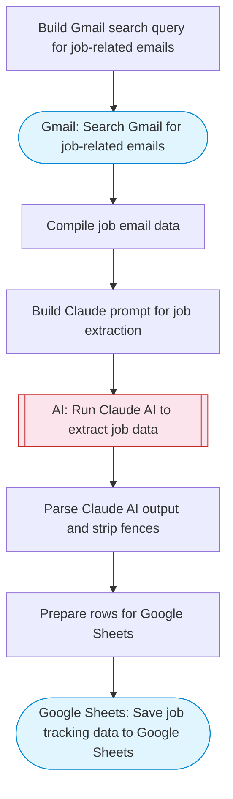

# AI Job Application Tracker

Searches Gmail for job-related emails (applications, interviews, offers, rejections), uses Claude AI to extract company name, role, status, and next steps, then saves structured tracking data to Google Sheets.

> **Works with any AI agent.** Paste this page's URL into Claude Code, Codex, Cursor, Windsurf, OpenClaw, or any coding agent — it will read the docs, connect your platforms, and run this flow for you.

## Quick Start

```bash
# 1. Connect your platforms (one-time setup)
one add gmail
one add google-sheets

# 2. Run the flow
one flow execute n8n-5906-job-application-tracker \
  --input spreadsheetId="..." \
  --input sheetName="..." \
  --input daysBack="..."
```

## Platforms

| Platform | Used for |
|----------|----------|
| Gmail | Searching job emails |
| Google Sheets | Saving tracking data |

> Don't have these connected yet? Run `one list` to check, then `one add <platform>` to connect.

## What it does

1. Build Gmail search query for job-related emails
2. Search Gmail for job-related emails
3. Compile job email data
4. Build Claude prompt for job extraction
5. Run Claude AI to extract job data
6. Parse Claude AI output and strip fences
7. Prepare rows for Google Sheets
8. Save job tracking data to Google Sheets

## Flow diagram



## Inputs

| Input | Required | Description |
|-------|----------|-------------|
| `spreadsheetId` | Yes | Google Sheets spreadsheet ID to save job tracking data |
| `sheetName` | No | Sheet tab name (default: 'Job Applications') (default: Job Applications) |
| `daysBack` | No | Number of days to search back for job emails (default: 7) (default: 7) |

---

<sub>Based on [n8n #5906](https://n8n.io/workflows/5906) · 79.8K views on n8n · by [vxi14](https://n8n.io/creators/vxi14) · Converted to One CLI on 2026-03-25</sub>
