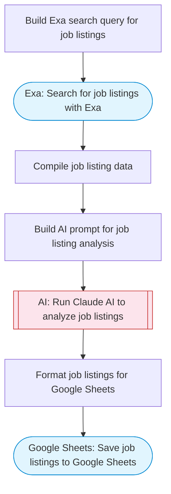

# Job listing finder with Exa search and Google Sheets

Searches for job listings matching specified criteria using Exa, uses Claude AI to parse and score each listing against the user's preferences, and saves organized results to Google Sheets.

> **Works with any AI agent.** Paste this page's URL into Claude Code, Codex, Cursor, Windsurf, OpenClaw, or any coding agent — it will read the docs, connect your platforms, and run this flow for you.

## Quick Start

```bash
# 1. Connect your platforms (one-time setup)
one add exa
one add google-sheets

# 2. Run the flow
one flow execute n8n-4775-job-finder-sheets \
  --input jobQuery="your question here" \
  --input location="San Francisco" \
  --input salaryRange="..." \
  --input mustHaveSkills="..."
```

## Platforms

| Platform | Used for |
|----------|----------|
| Exa | Searching job listings |
| Google Sheets | Saving job results |

> Don't have these connected yet? Run `one list` to check, then `one add <platform>` to connect.

## What it does

1. Build Exa search query for job listings
2. Search for job listings with Exa
3. Compile job listing data
4. Build AI prompt for job listing analysis
5. Run Claude AI to analyze job listings
6. Format job listings for Google Sheets
7. Save job listings to Google Sheets

## Flow diagram



## Inputs

| Input | Required | Description |
|-------|----------|-------------|
| `jobQuery` | Yes | Job search query (e.g. 'Senior Software Engineer remote React') |
| `location` | No | Preferred job location (e.g. 'San Francisco', 'Remote') (default: ) |
| `salaryRange` | No | Target salary range (e.g. '$150K-$200K') (default: ) |
| `mustHaveSkills` | No | Required skills (e.g. 'React, TypeScript, Node.js') (default: ) |

---

<sub>Based on [n8n #4775](https://n8n.io/workflows/4775) · 24.6K views on n8n · by [dvirsharon](https://n8n.io/creators/dvirsharon) · Converted to One CLI on 2026-03-25</sub>
