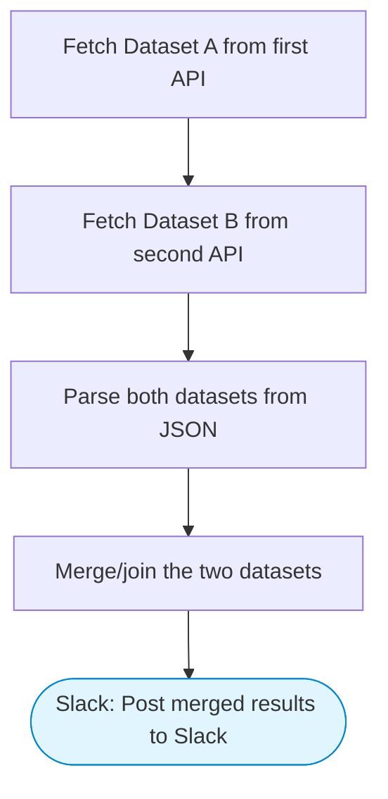

# Joining different datasets

Data merger pipeline: fetches data from two different API endpoints, merges and joins the datasets using SQL-like logic in a code step, and posts the combined results to Slack with Block Kit formatting.

> **Works with any AI agent.** Paste this page's URL into Claude Code, Codex, Cursor, Windsurf, OpenClaw, or any coding agent — it will read the docs, connect your platforms, and run this flow for you.

## Quick Start

```bash
# 1. Connect your platforms (one-time setup)
one add slack

# 2. Run the flow
one flow execute n8n-1747-joining-different-datasets \
  --input apiUrlA="https://example.com" \
  --input apiUrlB="https://example.com" \
  --input joinKey="..." \
  --input slackChannel="C01ABC123"
```

## Platforms

| Platform | Used for |
|----------|----------|
| Slack | Post merged results to Slack |

> Don't have these connected yet? Run `one list` to check, then `one add <platform>` to connect.

## What it does

1. Fetch Dataset A from first API
2. Fetch Dataset B from second API
3. Parse both datasets from JSON
4. Merge/join the two datasets
5. Post merged results to Slack

## Flow diagram



## Inputs

| Input | Required | Description |
|-------|----------|-------------|
| `apiUrlA` | No | First API endpoint URL (default: JSONPlaceholder users) (default: https://jsonplaceholder.typicode.com/users) |
| `apiUrlB` | No | Second API endpoint URL (default: JSONPlaceholder posts) (default: https://jsonplaceholder.typicode.com/posts) |
| `joinKey` | No | Join key as 'keyA:keyB' (default: 'id:userId' to join users with their posts) (default: id:userId) |
| `slackChannel` | Yes | Slack channel ID to post merged results |

---

<sub>Based on [n8n #1747](https://n8n.io/workflows/1747) · 126.3K views on n8n · by [jon-n8n](https://n8n.io/creators/jon-n8n) · Converted to One CLI on 2026-03-24</sub>
