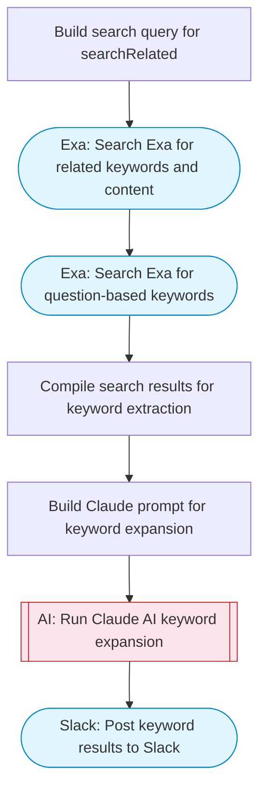

# AI keyword generator and expander

Takes a seed keyword, uses Exa to find related search terms and trending queries, Claude AI expands and categorizes the keywords by intent and volume potential, then posts the organized keyword list to Slack. Adapted from n8n's Google Autosuggest keyword generation workflow.

> **Works with any AI agent.** Paste this page's URL into Claude Code, Codex, Cursor, Windsurf, OpenClaw, or any coding agent — it will read the docs, connect your platforms, and run this flow for you.

## Quick Start

```bash
# 1. Connect your platforms (one-time setup)
one add exa
one add slack

# 2. Run the flow
one flow execute n8n-193-keyword-generator \
  --input seedKeyword="..." \
  --input slackChannel="C01ABC123" \
  --input industry="B2B SaaS"
```

## Platforms

| Platform | Used for |
|----------|----------|
| Exa | Keyword research |
| Slack | Posting keyword results |

> Don't have these connected yet? Run `one list` to check, then `one add <platform>` to connect.

## What it does

1. Build search query for searchRelated
2. Search Exa for related keywords and content
3. Search Exa for question-based keywords
4. Compile search results for keyword extraction
5. Build Claude prompt for keyword expansion
6. Run Claude AI keyword expansion
7. Post keyword results to Slack

## Flow diagram



## Inputs

| Input | Required | Description |
|-------|----------|-------------|
| `seedKeyword` | Yes | The seed keyword to expand (e.g., 'project management software') |
| `slackChannel` | Yes | Slack channel ID to post the keyword results |
| `industry` | No | Industry or niche context for keyword generation (default: general) |

---

<sub>Based on [n8n #193](https://n8n.io/workflows/193) · 31.7K views on n8n · Converted to One CLI on 2026-03-25</sub>
