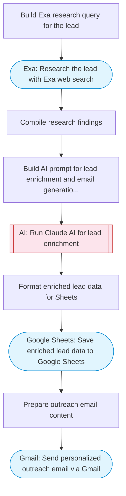

# Lead enrichment pipeline with Exa research and email outreach

Takes lead names or companies from Google Sheets, uses Exa to research each lead online, enriches with Claude AI analysis, saves enriched data back to Sheets, and sends personalized outreach emails via Gmail.

> **Works with any AI agent.** Paste this page's URL into Claude Code, Codex, Cursor, Windsurf, OpenClaw, or any coding agent — it will read the docs, connect your platforms, and run this flow for you.

## Quick Start

```bash
# 1. Connect your platforms (one-time setup)
one add exa
one add google-sheets
one add gmail

# 2. Run the flow
one flow execute n8n-3791-lead-enrichment-email \
  --input leadName="..." \
  --input leadEmail="user@example.com" \
  --input companyName="..." \
  --input outreachPurpose="..."
```

## Platforms

| Platform | Used for |
|----------|----------|
| Exa | Researching leads online |
| Google Sheets | Reading and updating lead data |
| Gmail | Sending outreach emails |

> Don't have these connected yet? Run `one list` to check, then `one add <platform>` to connect.

## What it does

1. Build Exa research query for the lead
2. Research the lead with Exa web search
3. Compile research findings
4. Build AI prompt for lead enrichment and email generation
5. Run Claude AI for lead enrichment
6. Format enriched lead data for Sheets
7. Save enriched lead data to Google Sheets
8. Prepare outreach email content
9. Send personalized outreach email via Gmail

## Flow diagram



## Inputs

| Input | Required | Description |
|-------|----------|-------------|
| `leadName` | Yes | Lead name or company to research (e.g. 'Jane Smith at Acme Corp') |
| `leadEmail` | Yes | Lead email address for outreach |
| `companyName` | No | Company name for research context (default: ) |
| `outreachPurpose` | Yes | Purpose of outreach (e.g. 'Schedule a demo of our project management tool') |

---

<sub>Based on [n8n #3791](https://n8n.io/workflows/3791) · 24.5K views on n8n · by [mjomba](https://n8n.io/creators/mjomba) · Converted to One CLI on 2026-03-25</sub>
