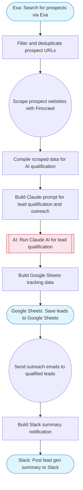

# Lead generation agent: search, scrape, qualify, outreach

Automated lead generation pipeline. Uses Exa to search for prospects, Firecrawl to scrape their websites, Claude AI to qualify leads and compose personalized outreach emails, sends via Gmail, and tracks everything in Google Sheets.

> **Works with any AI agent.** Paste this page's URL into Claude Code, Codex, Cursor, Windsurf, OpenClaw, or any coding agent — it will read the docs, connect your platforms, and run this flow for you.

## Quick Start

```bash
# 1. Connect your platforms (one-time setup)
one add exa
one add firecrawl
one add gmail
one add google-sheets
one add slack

# 2. Run the flow
one flow execute n8n-7423-lead-generation-agent \
  --input slackChannel="C01ABC123" \
  --input industry="B2B SaaS" \
  --input location="San Francisco" \
  --input valueProposition="..." \
  --input senderName="Alex" \
  --input maxLeads="10"
```

## Platforms

| Platform | Used for |
|----------|----------|
| Exa | Prospect search |
| Firecrawl | Website scraping |
| Gmail | Sending outreach emails |
| Google Sheets | Tracking |
| Slack | Status notifications |

> Don't have these connected yet? Run `one list` to check, then `one add <platform>` to connect.

## What it does

1. Search for prospects via Exa
2. Filter and deduplicate prospect URLs
3. Scrape prospect websites with Firecrawl
4. Compile scraped data for AI qualification
5. Build Claude prompt for lead qualification and outreach
6. Run Claude AI for lead qualification
7. Save leads to Google Sheets
8. Send outreach emails to qualified leads
9. Post lead gen summary to Slack

## Flow diagram



## Inputs

| Input | Required | Description |
|-------|----------|-------------|
| `slackChannel` | Yes | Slack channel for lead gen notifications |
| `industry` | Yes | Target industry (e.g. 'SaaS companies', 'dental clinics', 'e-commerce brands') |
| `location` | Yes | Target location (e.g. 'San Francisco, CA', 'London, UK') |
| `valueProposition` | Yes | Your value proposition for the outreach email (e.g. 'We help SaaS companies reduce churn by 40% with AI-powered analytics') |
| `senderName` | No | Name to use in outreach email signature (default: Sales Team) |
| `maxLeads` | No | Maximum number of leads to process (1-20) (default: 10) |

---

<sub>Based on [n8n #7423](https://n8n.io/workflows/7423) · 56.7K views on n8n · by [rakinjakaria](https://n8n.io/creators/rakinjakaria) · Converted to One CLI on 2026-03-25</sub>
