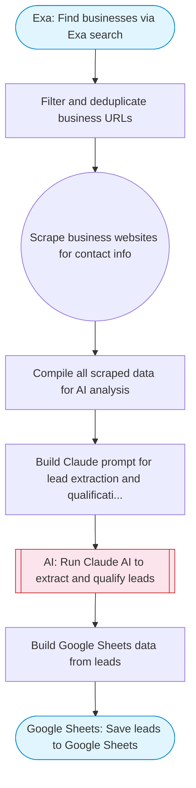

# Lead generation system: find businesses, scrape emails, qualify leads

Uses Exa to find businesses by type and location, Firecrawl to scrape their websites for contact information, Claude AI to extract and qualify leads with grades, and saves qualified leads to Google Sheets.

> **Works with any AI agent.** Paste this page's URL into Claude Code, Codex, Cursor, Windsurf, OpenClaw, or any coding agent — it will read the docs, connect your platforms, and run this flow for you.

## Quick Start

```bash
# 1. Connect your platforms (one-time setup)
one add exa
one add firecrawl
one add google-sheets

# 2. Run the flow
one flow execute n8n-5385-lead-generation-system \
  --input businessType="..." \
  --input location="San Francisco" \
  --input maxResults="10"
```

## Platforms

| Platform | Used for |
|----------|----------|
| Exa | Business search |
| Firecrawl | Website scraping |
| Google Sheets | Connection key |

> Don't have these connected yet? Run `one list` to check, then `one add <platform>` to connect.

## What it does

1. Find businesses via Exa search
2. Filter and deduplicate business URLs
3. Scrape business websites for contact info
4. Compile all scraped data for AI analysis
5. Build Claude prompt for lead extraction and qualification
6. Run Claude AI to extract and qualify leads
7. Save leads to Google Sheets

## Flow diagram



## Inputs

| Input | Required | Description |
|-------|----------|-------------|
| `businessType` | Yes | Type of business to search for (e.g. 'dentists', 'restaurants', 'plumbers') |
| `location` | Yes | City or area to search (e.g. 'Calgary, AB', 'Austin, TX') |
| `maxResults` | No | Maximum number of businesses to scrape (1-20) (default: 10) |

---

<sub>Based on [n8n #5385](https://n8n.io/workflows/5385) · 105.9K views on n8n · by [nicksaraev](https://n8n.io/creators/nicksaraev) · Converted to One CLI on 2026-03-24</sub>
