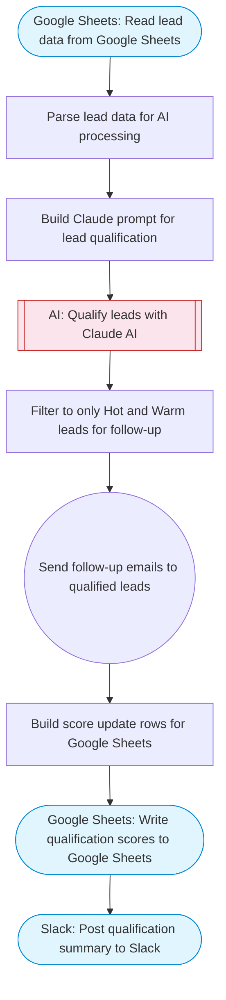

# AI Lead Qualification Agent with Gmail and Google Sheets

Reads lead data from a Google Sheet, uses Claude AI to score and qualify each lead based on customizable criteria, sends personalized follow-up emails via Gmail for qualified leads, updates the sheet with scores, and posts a qualification summary to Slack.

> **Works with any AI agent.** Paste this page's URL into Claude Code, Codex, Cursor, Windsurf, OpenClaw, or any coding agent — it will read the docs, connect your platforms, and run this flow for you.

## Quick Start

```bash
# 1. Connect your platforms (one-time setup)
one add google-sheets
one add gmail
one add slack

# 2. Run the flow
one flow execute n8n-3912-lead-qualification-agent \
  --input spreadsheetId="..." \
  --input dataRange="..." \
  --input qualificationCriteria="..." \
  --input companyName="..." \
  --input slackChannel="C01ABC123"
```

## Platforms

| Platform | Used for |
|----------|----------|
| Google Sheets | Connection key |
| Gmail | Sending follow-up emails |
| Slack | Post qualification summary to Slack |

> Don't have these connected yet? Run `one list` to check, then `one add <platform>` to connect.

## What it does

1. Read lead data from Google Sheets
2. Parse lead data for AI processing
3. Build Claude prompt for lead qualification
4. Qualify leads with Claude AI
5. Filter to only Hot and Warm leads for follow-up
6. Send follow-up emails to qualified leads
7. Build score update rows for Google Sheets
8. Write qualification scores to Google Sheets
9. Post qualification summary to Slack

## Flow diagram



## Inputs

| Input | Required | Description |
|-------|----------|-------------|
| `spreadsheetId` | Yes | Google Sheets spreadsheet ID with lead data (columns: Name, Email, Company, Role, Source, Notes) |
| `dataRange` | No | Sheet range containing lead data (default: Leads!A:F) |
| `qualificationCriteria` | No | Ideal customer profile and qualification criteria (default: B2B SaaS companies, decision makers (VP/Director/C-level), company size 50-500 employees) |
| `companyName` | No | Your company name for follow-up emails (default: Our Company) |
| `slackChannel` | Yes | Slack channel for qualification summary |

---

<sub>Based on [n8n #3912](https://n8n.io/workflows/3912) · 22.2K views on n8n · by [drfiras](https://n8n.io/creators/drfiras) · Converted to One CLI on 2026-03-25</sub>
