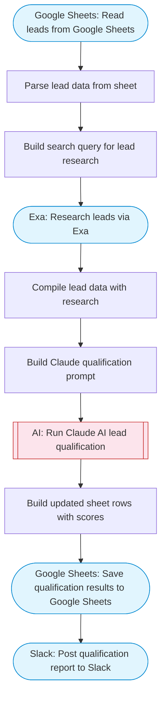

# Qualify new leads in Google Sheets with AI

Reads new leads from Google Sheets, uses Claude AI to qualify each lead based on company data and scoring criteria, then updates the sheet with qualification scores and notes. Adapted from n8n's GPT-4 lead qualification workflow.

> **Works with any AI agent.** Paste this page's URL into Claude Code, Codex, Cursor, Windsurf, OpenClaw, or any coding agent — it will read the docs, connect your platforms, and run this flow for you.

## Quick Start

```bash
# 1. Connect your platforms (one-time setup)
one add google-sheets
one add exa
one add slack

# 2. Run the flow
one flow execute n8n-2163-lead-qualifier-sheets \
  --input slackChannel="C01ABC123" \
  --input spreadsheetId="..." \
  --input sheetRange="..." \
  --input qualificationCriteria="..."
```

## Platforms

| Platform | Used for |
|----------|----------|
| Google Sheets | Connection key |
| Exa | Company research |
| Slack | Notification |

> Don't have these connected yet? Run `one list` to check, then `one add <platform>` to connect.

## What it does

1. Read leads from Google Sheets
2. Parse lead data from sheet
3. Build search query for lead research
4. Research leads via Exa
5. Compile lead data with research
6. Build Claude qualification prompt
7. Run Claude AI lead qualification
8. Build updated sheet rows with scores
9. Save qualification results to Google Sheets
10. Post qualification report to Slack

## Flow diagram



## Inputs

| Input | Required | Description |
|-------|----------|-------------|
| `slackChannel` | Yes | Slack channel ID for qualification results |
| `spreadsheetId` | Yes | Google Sheets spreadsheet ID with lead data |
| `sheetRange` | No | Sheet range with columns: Name, Company, Email, Website, Notes (default: Leads!A1:E50) |
| `qualificationCriteria` | No | Criteria for qualifying leads (default: B2B SaaS companies, 20+ employees, active online presence, in growth stage) |

---

<sub>Based on [n8n #2163](https://n8n.io/workflows/2163) · 29.6K views on n8n · by [yulia](https://n8n.io/creators/yulia) · Converted to One CLI on 2026-03-25</sub>
