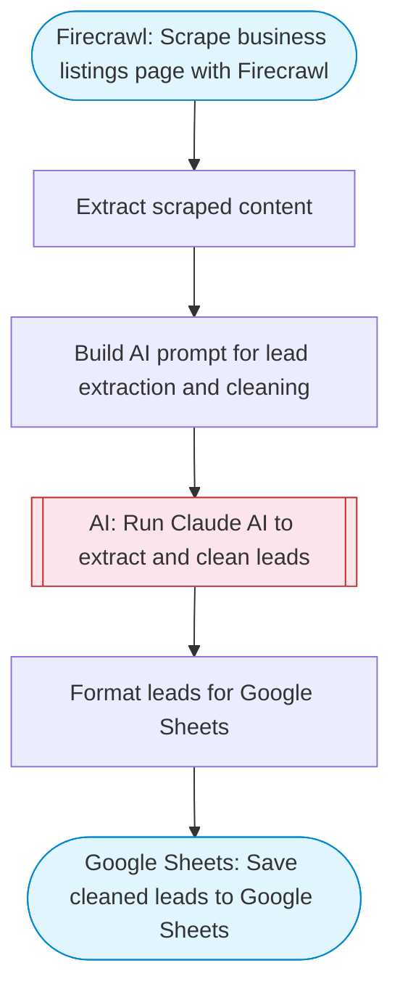

# Business lead scraper with AI cleaning to Google Sheets

Scrapes a business directory or listings page with Firecrawl, uses Claude AI to extract and clean lead data (names, emails, phones, companies), and saves the structured leads to Google Sheets.

> **Works with any AI agent.** Paste this page's URL into Claude Code, Codex, Cursor, Windsurf, OpenClaw, or any coding agent — it will read the docs, connect your platforms, and run this flow for you.

## Quick Start

```bash
# 1. Connect your platforms (one-time setup)
one add firecrawl
one add google-sheets

# 2. Run the flow
one flow execute n8n-4295-lead-scraper-sheets \
  --input targetUrl="https://example.com" \
  --input leadType="..."
```

## Platforms

| Platform | Used for |
|----------|----------|
| Firecrawl | Scraping the listings page |
| Google Sheets | Saving leads |

> Don't have these connected yet? Run `one list` to check, then `one add <platform>` to connect.

## What it does

1. Scrape business listings page with Firecrawl
2. Extract scraped content
3. Build AI prompt for lead extraction and cleaning
4. Run Claude AI to extract and clean leads
5. Format leads for Google Sheets
6. Save cleaned leads to Google Sheets

## Flow diagram



## Inputs

| Input | Required | Description |
|-------|----------|-------------|
| `targetUrl` | Yes | URL of the business directory or listings page to scrape (e.g. 'https://www.yelp.com/search?find_desc=plumbers&find_loc=San+Francisco') |
| `leadType` | No | Type of leads to extract (e.g. 'plumbers', 'SaaS companies', 'restaurants') (default: business leads) |

---

<sub>Based on [n8n #4295](https://n8n.io/workflows/4295) · 25.4K views on n8n · by [dae221](https://n8n.io/creators/dae221) · Converted to One CLI on 2026-03-25</sub>
