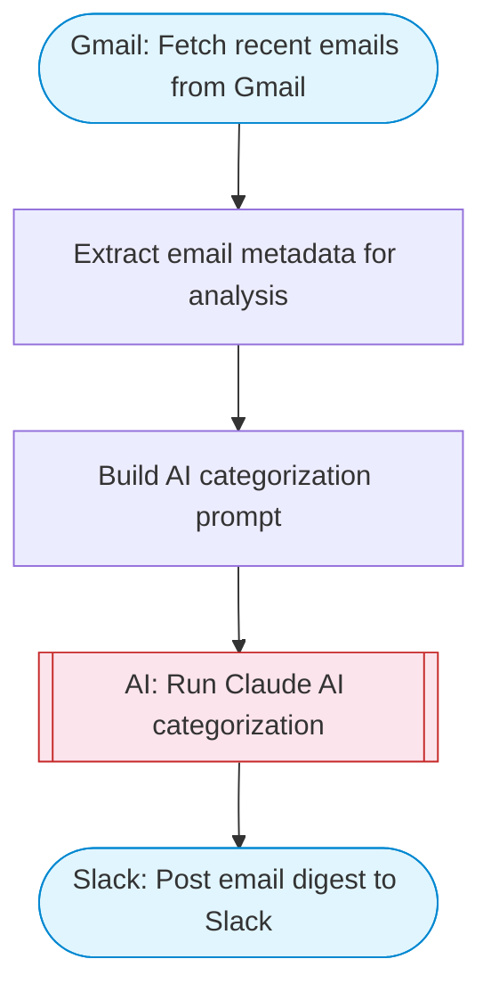

# Gmail Inbox Analyzer — AI Email Categorizer

Fetch recent emails from Gmail, use Claude AI to categorize and prioritize them, then send a formatted summary to Slack. Helps you triage your inbox automatically.

> **Works with any AI agent.** Paste this page's URL into Claude Code, Codex, Cursor, Windsurf, OpenClaw, or any coding agent — it will read the docs, connect your platforms, and run this flow for you.

## Quick Start

```bash
# 1. Connect your platforms (one-time setup)
one add gmail
one add slack

# 2. Run the flow
one flow execute n8n-8527-learn-basics-in \
  --input slackChannel="C01ABC123" \
  --input maxEmails="user@example.com"
```

## Platforms

| Platform | Used for |
|----------|----------|
| Gmail | Fetch recent emails from Gmail |
| Slack | Post email digest to Slack |

> Don't have these connected yet? Run `one list` to check, then `one add <platform>` to connect.

## What it does

1. Fetch recent emails from Gmail
2. Extract email metadata for analysis
3. Build AI categorization prompt
4. Run Claude AI categorization
5. Post email digest to Slack

## Flow diagram



## Inputs

| Input | Required | Description |
|-------|----------|-------------|
| `slackChannel` | Yes | Slack channel ID to post the email summary |
| `maxEmails` | No | Maximum number of recent emails to analyze (default 10) (default: 10) |

---

<sub>Based on [n8n #8527](https://n8n.io/workflows/8527) · 197.8K views on n8n · by [miha](https://n8n.io/creators/miha) · Converted to One CLI on 2026-03-24</sub>
