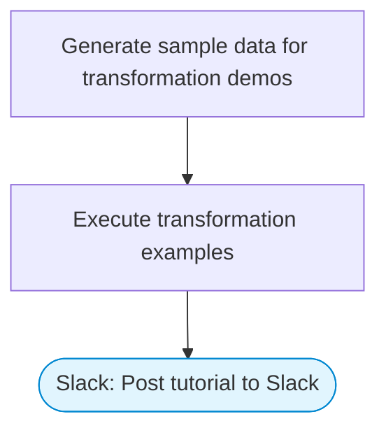

# Data transformation tutorial: code step examples

Adapted from the n8n expressions tutorial. Demonstrates various code step transformations (string manipulation, array operations, date formatting, object restructuring) and posts a comprehensive reference guide to Slack with Block Kit formatting.

> **Works with any AI agent.** Paste this page's URL into Claude Code, Codex, Cursor, Windsurf, OpenClaw, or any coding agent — it will read the docs, connect your platforms, and run this flow for you.

## Quick Start

```bash
# 1. Connect your platforms (one-time setup)
one add slack

# 2. Run the flow
one flow execute n8n-5271-learn-expressions \
  --input slackChannel="C01ABC123" \
  --input focusArea="..."
```

## Platforms

| Platform | Used for |
|----------|----------|
| Slack | Posting transformation examples |

> Don't have these connected yet? Run `one list` to check, then `one add <platform>` to connect.

## What it does

1. Generate sample data for transformation demos
2. Execute transformation examples
3. Post tutorial to Slack

## Flow diagram



## Inputs

| Input | Required | Description |
|-------|----------|-------------|
| `slackChannel` | Yes | Slack channel ID to post the tutorial |
| `focusArea` | No | Focus area: all, strings, arrays, dates, objects, math (default: all) |

---

<sub>Based on [n8n #5271](https://n8n.io/workflows/5271) · 53.3K views on n8n · by [lucaspeyrin](https://n8n.io/creators/lucaspeyrin) · Converted to One CLI on 2026-03-25</sub>
