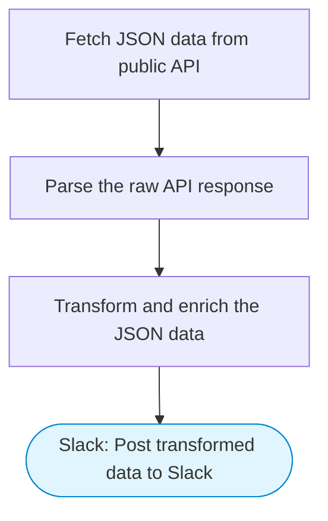

# Data Transformer: Fetch, Transform, and Post JSON to Slack

Data transformer pipeline: fetches JSON data from a public API, transforms and enriches it with a code step, formats the output nicely, and posts the results to Slack using Block Kit.

> **Works with any AI agent.** Paste this page's URL into Claude Code, Codex, Cursor, Windsurf, OpenClaw, or any coding agent — it will read the docs, connect your platforms, and run this flow for you.

## Quick Start

```bash
# 1. Connect your platforms (one-time setup)
one add slack

# 2. Run the flow
one flow execute n8n-5170-learn-json-basics \
  --input apiUrl="https://example.com" \
  --input slackChannel="C01ABC123"
```

## Platforms

| Platform | Used for |
|----------|----------|
| Slack | Post transformed data to Slack |

> Don't have these connected yet? Run `one list` to check, then `one add <platform>` to connect.

## What it does

1. Fetch JSON data from public API
2. Parse the raw API response
3. Transform and enrich the JSON data
4. Post transformed data to Slack

## Flow diagram



## Inputs

| Input | Required | Description |
|-------|----------|-------------|
| `apiUrl` | No | Public API URL to fetch JSON from (default: JSONPlaceholder posts) (default: https://jsonplaceholder.typicode.com/posts) |
| `slackChannel` | Yes | Slack channel ID to post the transformed data |

---

<sub>Based on [n8n #5170](https://n8n.io/workflows/5170) · 133.9K views on n8n · by [lucaspeyrin](https://n8n.io/creators/lucaspeyrin) · Converted to One CLI on 2026-03-24</sub>
