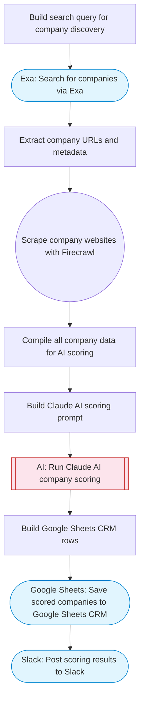

# LinkedIn company search, AI scoring, and Sheets CRM

Searches for companies using Exa, scrapes their websites with Firecrawl, uses Claude AI to score and qualify them, and adds the results to a Google Sheets CRM. Adapted from n8n's LinkedIn company search and scoring workflow.

> **Works with any AI agent.** Paste this page's URL into Claude Code, Codex, Cursor, Windsurf, OpenClaw, or any coding agent — it will read the docs, connect your platforms, and run this flow for you.

## Quick Start

```bash
# 1. Connect your platforms (one-time setup)
one add exa
one add firecrawl
one add google-sheets
one add slack

# 2. Run the flow
one flow execute n8n-3904-linkedin-company-scorer \
  --input slackChannel="C01ABC123" \
  --input searchQuery="your question here" \
  --input scoringCriteria="..." \
  --input spreadsheetId="..."
```

## Platforms

| Platform | Used for |
|----------|----------|
| Exa | Company search |
| Firecrawl | Website scraping |
| Google Sheets | Crm output |
| Slack | Notifications |

> Don't have these connected yet? Run `one list` to check, then `one add <platform>` to connect.

## What it does

1. Build search query for company discovery
2. Search for companies via Exa
3. Extract company URLs and metadata
4. Scrape company websites with Firecrawl
5. Compile all company data for AI scoring
6. Build Claude AI scoring prompt
7. Run Claude AI company scoring
8. Save scored companies to Google Sheets CRM
9. Post scoring results to Slack

## Flow diagram



## Inputs

| Input | Required | Description |
|-------|----------|-------------|
| `slackChannel` | Yes | Slack channel ID for scoring results |
| `searchQuery` | Yes | Company search query (e.g. 'AI startups in fintech') |
| `scoringCriteria` | No | Criteria for scoring companies (default: B2B SaaS companies with product-market fit, 10-500 employees, funded) |
| `spreadsheetId` | Yes | Google Sheets spreadsheet ID for the CRM |

---

<sub>Based on [n8n #3904](https://n8n.io/workflows/3904) · 30.5K views on n8n · by [yaznow](https://n8n.io/creators/yaznow) · Converted to One CLI on 2026-03-25</sub>
