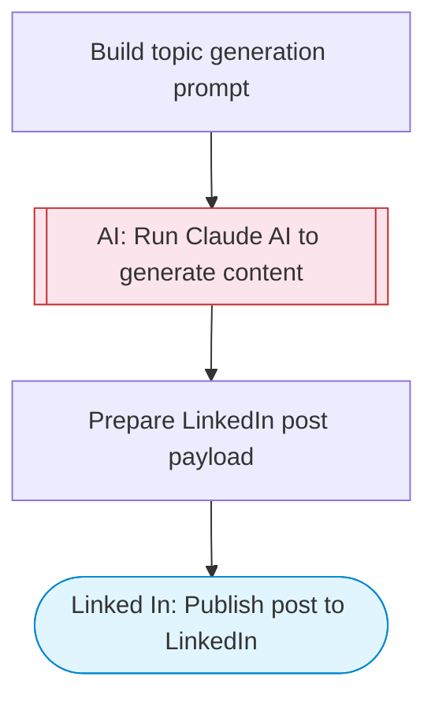

# Automated LinkedIn content creation with GPT-4 and DALL-E for scheduled posts

LinkedIn content pipeline: Claude AI generates trending topic ideas, researches angles and hooks, writes an engaging LinkedIn post draft, and publishes it directly to LinkedIn.

> **Works with any AI agent.** Paste this page's URL into Claude Code, Codex, Cursor, Windsurf, OpenClaw, or any coding agent — it will read the docs, connect your platforms, and run this flow for you.

## Quick Start

```bash
# 1. Connect your platforms (one-time setup)
one add linked-in

# 2. Run the flow
one flow execute n8n-4968-linkedin-content-creation \
  --input industry="B2B SaaS" \
  --input authorUrn="..." \
  --input writingStyle="..."
```

## Platforms

| Platform | Used for |
|----------|----------|
| Linked In | Publish post to LinkedIn |

> Don't have these connected yet? Run `one list` to check, then `one add <platform>` to connect.

## What it does

1. Build topic generation prompt
2. Run Claude AI to generate content
3. Prepare LinkedIn post payload
4. Publish post to LinkedIn

## Flow diagram



## Inputs

| Input | Required | Description |
|-------|----------|-------------|
| `industry` | Yes | Your industry or niche (e.g. 'AI automation', 'SaaS marketing', 'developer tools') |
| `authorUrn` | Yes | LinkedIn author URN (e.g. 'urn:li:person:YOUR_ID' or 'urn:li:organization:YOUR_ORG_ID') |
| `writingStyle` | No | Desired writing style for the LinkedIn post (default: conversational, insightful, with a personal anecdote or real example) |

---

<sub>Based on [n8n #4968](https://n8n.io/workflows/4968) · 152.3K views on n8n · by [agenticvibe](https://n8n.io/creators/agenticvibe) · Converted to One CLI on 2026-03-24</sub>
