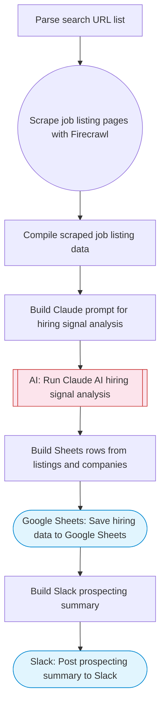

# LinkedIn Hiring Signal Scraper & Prospecting Tool

Scrapes LinkedIn job listing pages via Firecrawl, uses Claude AI to extract hiring signals and identify high-intent B2B leads, and saves structured results to Google Sheets with a prospecting summary to Slack. Adapted from n8n's LinkedIn job listings scraper with Bright Data.

> **Works with any AI agent.** Paste this page's URL into Claude Code, Codex, Cursor, Windsurf, OpenClaw, or any coding agent — it will read the docs, connect your platforms, and run this flow for you.

## Quick Start

```bash
# 1. Connect your platforms (one-time setup)
one add firecrawl
one add google-sheets
one add slack

# 2. Run the flow
one flow execute n8n-3580-linkedin-hiring-signals \
  --input searchUrls="https://example.com" \
  --input spreadsheetId="..." \
  --input slackChannel="C01ABC123" \
  --input targetRoles="..." \
  --input prospectingGoal="..."
```

## Platforms

| Platform | Used for |
|----------|----------|
| Firecrawl | Scraping job listings |
| Google Sheets | Saving results |
| Slack | Posting summary |

> Don't have these connected yet? Run `one list` to check, then `one add <platform>` to connect.

## What it does

1. Parse search URL list
2. Scrape job listing pages with Firecrawl
3. Compile scraped job listing data
4. Build Claude prompt for hiring signal analysis
5. Run Claude AI hiring signal analysis
6. Save hiring data to Google Sheets
7. Build Slack prospecting summary
8. Post prospecting summary to Slack

## Flow diagram



## Inputs

| Input | Required | Description |
|-------|----------|-------------|
| `searchUrls` | Yes | Comma-separated LinkedIn job search URLs or company career page URLs to scrape |
| `spreadsheetId` | Yes | Google Sheets spreadsheet ID for storing job listings |
| `slackChannel` | Yes | Slack channel for the prospecting summary |
| `targetRoles` | No | Comma-separated role keywords to filter (e.g. 'engineering manager, VP sales') (default: ) |
| `prospectingGoal` | No | What to look for in the hiring data (default: Identify companies with high hiring intent as potential B2B leads) |

---

<sub>Based on [n8n #3580](https://n8n.io/workflows/3580) · 20.4K views on n8n · by [yaron-nofluff](https://n8n.io/creators/yaron-nofluff) · Converted to One CLI on 2026-03-25</sub>
