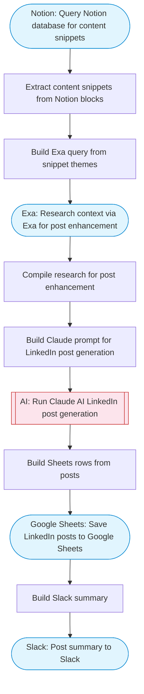

# LinkedIn Outreach Content Generator with Notion

Reads content snippets from a Notion database, researches relevant context via Exa, uses Claude AI to enhance and polish each snippet into engaging LinkedIn posts, and saves the finalized posts back to Google Sheets with a summary to Slack. Adapted from n8n's LinkedIn outreach with Notion and OpenAI workflow.

> **Works with any AI agent.** Paste this page's URL into Claude Code, Codex, Cursor, Windsurf, OpenClaw, or any coding agent — it will read the docs, connect your platforms, and run this flow for you.

## Quick Start

```bash
# 1. Connect your platforms (one-time setup)
one add notion
one add exa
one add google-sheets
one add slack

# 2. Run the flow
one flow execute n8n-2288-linkedin-outreach-notion \
  --input notionDatabaseId="..." \
  --input spreadsheetId="..." \
  --input slackChannel="C01ABC123"
```

## Platforms

| Platform | Used for |
|----------|----------|
| Notion | Reading content snippets |
| Exa | Contextual research |
| Google Sheets | Saving finalized posts |
| Slack | Posting summary |

> Don't have these connected yet? Run `one list` to check, then `one add <platform>` to connect.

## What it does

1. Query Notion database for content snippets
2. Extract content snippets from Notion blocks
3. Build Exa query from snippet themes
4. Research context via Exa for post enhancement
5. Compile research for post enhancement
6. Build Claude prompt for LinkedIn post generation
7. Run Claude AI LinkedIn post generation
8. Save LinkedIn posts to Google Sheets
9. Post summary to Slack

## Flow diagram



## Inputs

| Input | Required | Description |
|-------|----------|-------------|
| `notionDatabaseId` | Yes | Notion database ID containing content snippets for LinkedIn posts |
| `spreadsheetId` | Yes | Google Sheets spreadsheet ID for the post schedule |
| `slackChannel` | Yes | Slack channel ID for the summary |

---

<sub>Based on [n8n #2288](https://n8n.io/workflows/2288) · 20.5K views on n8n · by [mikulskisp](https://n8n.io/creators/mikulskisp) · Converted to One CLI on 2026-03-25</sub>
