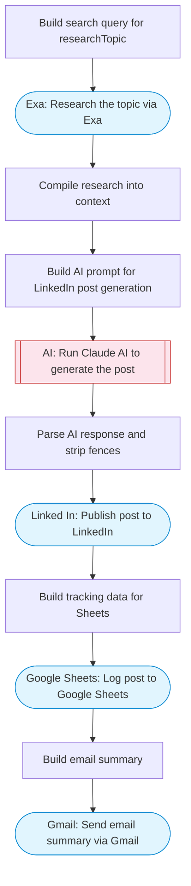

# AI LinkedIn Posts — Research, Generate, Publish, Track & Email

Uses Exa to research a topic, Claude AI generates an engaging LinkedIn post, publishes it via LinkedIn API, logs the post to Google Sheets for tracking, and sends an email summary via Gmail.

> **Works with any AI agent.** Paste this page's URL into Claude Code, Codex, Cursor, Windsurf, OpenClaw, or any coding agent — it will read the docs, connect your platforms, and run this flow for you.

## Quick Start

```bash
# 1. Connect your platforms (one-time setup)
one add exa
one add linked-in
one add google-sheets
one add gmail

# 2. Run the flow
one flow execute n8n-4005-linkedin-posts-ai \
  --input topic="your topic here" \
  --input authorUrn="..." \
  --input emailTo="user@example.com" \
  --input tone="..."
```

## Platforms

| Platform | Used for |
|----------|----------|
| Exa | Research the topic via Exa |
| Linked In | Publish post to LinkedIn |
| Google Sheets | Log post to Google Sheets |
| Gmail | Send email summary via Gmail |

> Don't have these connected yet? Run `one list` to check, then `one add <platform>` to connect.

## What it does

1. Build search query for researchTopic
2. Research the topic via Exa
3. Compile research into context
4. Build AI prompt for LinkedIn post generation
5. Run Claude AI to generate the post
6. Parse AI response and strip fences
7. Publish post to LinkedIn
8. Build tracking data for Sheets
9. Log post to Google Sheets
10. Build email summary
11. Send email summary via Gmail

## Flow diagram



## Inputs

| Input | Required | Description |
|-------|----------|-------------|
| `topic` | Yes | Topic for the LinkedIn post (e.g. 'AI agents transforming customer service') |
| `authorUrn` | Yes | LinkedIn author URN (e.g. 'urn:li:person:abc123' or 'urn:li:organization:12345') |
| `emailTo` | Yes | Email address to send the post summary to |
| `tone` | No | Desired tone for the post (e.g. 'thought leadership', 'casual', 'data-driven') (default: professional yet conversational) |

---

<sub>Based on [n8n #4005](https://n8n.io/workflows/4005) · 43.6K views on n8n · by [shindearyan](https://n8n.io/creators/shindearyan) · Converted to One CLI on 2026-03-25</sub>
