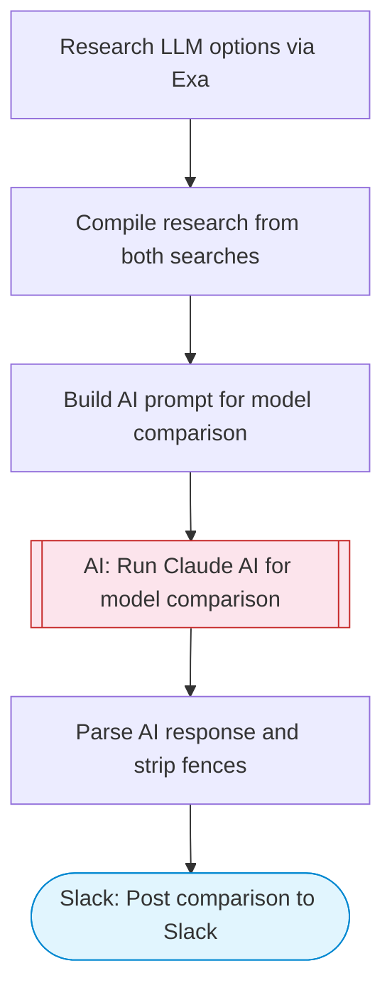

# AI Model Comparison — Exa Research + Claude Analysis to Slack

Researches open-source and proprietary LLM options via Exa, uses Claude AI to compare models across key dimensions (performance, cost, speed, use cases), and posts a structured comparison to Slack.

> **Works with any AI agent.** Paste this page's URL into Claude Code, Codex, Cursor, Windsurf, OpenClaw, or any coding agent — it will read the docs, connect your platforms, and run this flow for you.

## Quick Start

```bash
# 1. Connect your platforms (one-time setup)
one add exa
one add slack

# 2. Run the flow
one flow execute n8n-1980-llm-comparison \
  --input slackChannel="C01ABC123" \
  --input useCase="..." \
  --input requirements="..."
```

## Platforms

| Platform | Used for |
|----------|----------|
| Exa | Web search |
| Slack | Post comparison to Slack |

> Don't have these connected yet? Run `one list` to check, then `one add <platform>` to connect.

## What it does

1. Research LLM options via Exa
2. Compile research from both searches
3. Build AI prompt for model comparison
4. Run Claude AI for model comparison
5. Parse AI response and strip fences
6. Post comparison to Slack

## Flow diagram



## Inputs

| Input | Required | Description |
|-------|----------|-------------|
| `slackChannel` | Yes | Slack channel ID to post the comparison |
| `useCase` | Yes | The use case to compare LLMs for (e.g. 'code generation', 'customer support chatbot', 'document summarization') |
| `requirements` | No | Specific requirements (e.g. 'must be open-source', 'low latency required', 'budget under $100/mo') (default: Balance of quality, speed, and cost) |

---

<sub>Based on [n8n #1980](https://n8n.io/workflows/1980) · 42.9K views on n8n · by [n8n-team](https://n8n.io/creators/n8n-team) · Converted to One CLI on 2026-03-25</sub>
