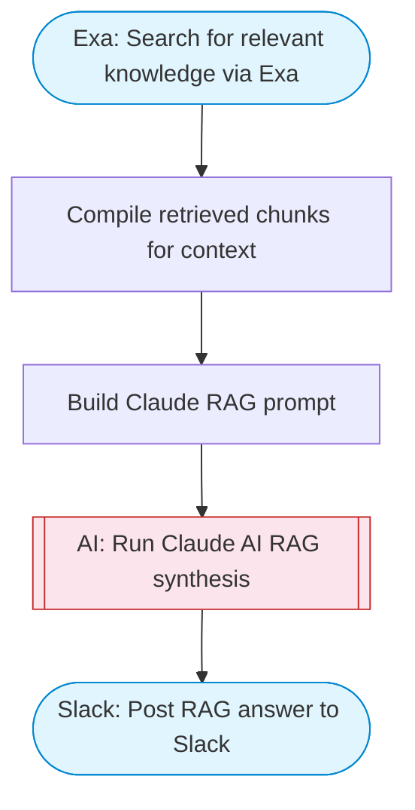

# RAG chatbot with retrieval augmented generation

Uses Exa search to retrieve relevant knowledge for a user question, then Claude AI synthesizes an answer grounded in the retrieved sources. Posts the result to Slack with Block Kit formatting including source attribution.

> **Works with any AI agent.** Paste this page's URL into Claude Code, Codex, Cursor, Windsurf, OpenClaw, or any coding agent — it will read the docs, connect your platforms, and run this flow for you.

## Quick Start

```bash
# 1. Connect your platforms (one-time setup)
one add exa
one add slack

# 2. Run the flow
one flow execute n8n-5148-local-chatbot-retrieval \
  --input question="your question here" \
  --input slackChannel="C01ABC123" \
  --input searchDomain="..."
```

## Platforms

| Platform | Used for |
|----------|----------|
| Exa | Web search retrieval |
| Slack | Post RAG answer to Slack |

> Don't have these connected yet? Run `one list` to check, then `one add <platform>` to connect.

## What it does

1. Search for relevant knowledge via Exa
2. Compile retrieved chunks for context
3. Build Claude RAG prompt
4. Run Claude AI RAG synthesis
5. Post RAG answer to Slack

## Flow diagram



## Inputs

| Input | Required | Description |
|-------|----------|-------------|
| `question` | Yes | User question to answer using RAG |
| `slackChannel` | Yes | Slack channel to post the answer |
| `searchDomain` | No | Optional domain to restrict search (e.g. 'docs.mycompany.com') |

---

<sub>Based on [n8n #5148](https://n8n.io/workflows/5148) · 112.8K views on n8n · by [thomasjanssen-tech](https://n8n.io/creators/thomasjanssen-tech) · Converted to One CLI on 2026-03-24</sub>
