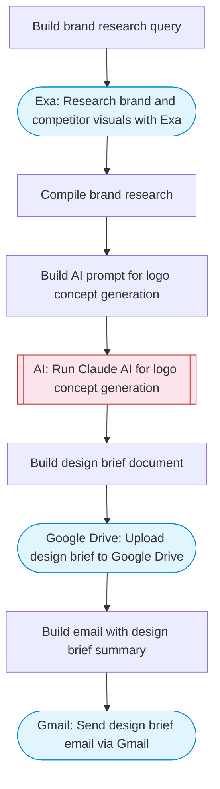

# AI logo concept generator with brand research and Drive storage

Researches a brand or company using Exa, uses Claude AI to generate detailed logo design concepts and style guidelines based on brand analysis, saves the design brief to Google Drive, and sends a summary via Gmail.

> **Works with any AI agent.** Paste this page's URL into Claude Code, Codex, Cursor, Windsurf, OpenClaw, or any coding agent — it will read the docs, connect your platforms, and run this flow for you.

## Quick Start

```bash
# 1. Connect your platforms (one-time setup)
one add exa
one add google-drive
one add gmail

# 2. Run the flow
one flow execute n8n-3954-logo-generator-drive \
  --input driveFolderId="..." \
  --input designerEmail="user@example.com" \
  --input brandName="..." \
  --input brandDescription="..." \
  --input designPreferences="..."
```

## Platforms

| Platform | Used for |
|----------|----------|
| Exa | Brand research |
| Google Drive | Saving design briefs |
| Gmail | Sending the design brief |

> Don't have these connected yet? Run `one list` to check, then `one add <platform>` to connect.

## What it does

1. Build brand research query
2. Research brand and competitor visuals with Exa
3. Compile brand research
4. Build AI prompt for logo concept generation
5. Run Claude AI for logo concept generation
6. Build design brief document
7. Upload design brief to Google Drive
8. Build email with design brief summary
9. Send design brief email via Gmail

## Flow diagram



## Inputs

| Input | Required | Description |
|-------|----------|-------------|
| `driveFolderId` | Yes | Google Drive folder ID for saving design documents |
| `designerEmail` | Yes | Email address to send the logo design brief to |
| `brandName` | Yes | Brand or company name (e.g. 'TechFlow Solutions') |
| `brandDescription` | Yes | Brief description of the brand (e.g. 'B2B SaaS workflow automation platform') |
| `designPreferences` | No | Any design preferences (e.g. 'modern, minimalist, blue tones') (default: ) |

---

<sub>Based on [n8n #3954](https://n8n.io/workflows/3954) · 24.0K views on n8n · by [jimleuk](https://n8n.io/creators/jimleuk) · Converted to One CLI on 2026-03-25</sub>
