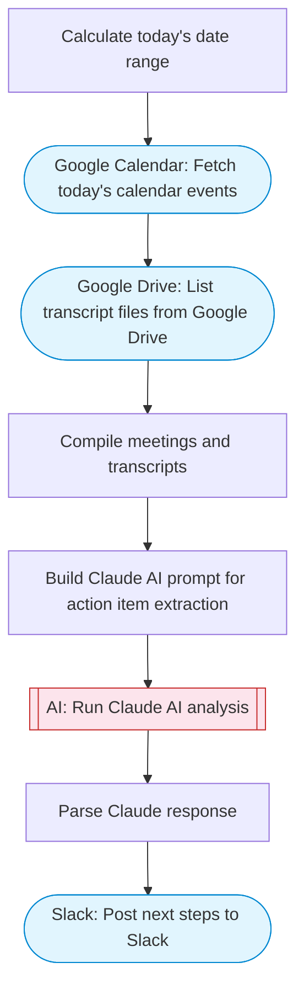

# Meeting Next Steps Extractor

Pull today's calendar events and Drive transcripts, use Claude AI to extract action items and next steps, and post a structured summary to Slack. Automates post-meeting follow-up.

> **Works with any AI agent.** Paste this page's URL into Claude Code, Codex, Cursor, Windsurf, OpenClaw, or any coding agent — it will read the docs, connect your platforms, and run this flow for you.

## Quick Start

```bash
# 1. Connect your platforms (one-time setup)
one add google-calendar
one add google-drive
one add slack

# 2. Run the flow
one flow execute n8n-2328-meeting-next-steps \
  --input slackChannel="C01ABC123" \
  --input transcriptFolderQuery="your question here"
```

## Platforms

| Platform | Used for |
|----------|----------|
| Google Calendar | Fetch today's calendar events |
| Google Drive | List transcript files from Google Drive |
| Slack | Post next steps to Slack |

> Don't have these connected yet? Run `one list` to check, then `one add <platform>` to connect.

## What it does

1. Calculate today's date range
2. Fetch today's calendar events
3. List transcript files from Google Drive
4. Compile meetings and transcripts
5. Build Claude AI prompt for action item extraction
6. Run Claude AI analysis
7. Parse Claude response
8. Post next steps to Slack

## Flow diagram



## Inputs

| Input | Required | Description |
|-------|----------|-------------|
| `slackChannel` | Yes | Slack channel ID to post the meeting next steps |
| `transcriptFolderQuery` | No | Google Drive query to find transcript files (default: name contains 'transcript' and mimeType != 'application/vnd.google-apps.folder') |

---

<sub>Based on [n8n #2328](https://n8n.io/workflows/2328) · 34.2K views on n8n · by [jimleuk](https://n8n.io/creators/jimleuk) · Converted to One CLI on 2026-03-25</sub>
