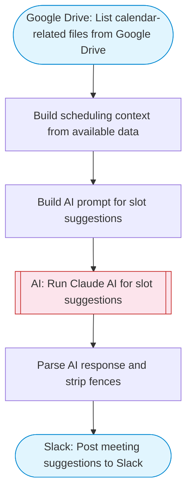

# AI Meeting Scheduler — Smart Slot Suggestions to Slack

Check calendar availability via Google Drive file listing, have Claude AI suggest optimal meeting slots based on preferences and constraints, and post the formatted suggestions to Slack with Block Kit.

> **Works with any AI agent.** Paste this page's URL into Claude Code, Codex, Cursor, Windsurf, OpenClaw, or any coding agent — it will read the docs, connect your platforms, and run this flow for you.

## Quick Start

```bash
# 1. Connect your platforms (one-time setup)
one add google-drive
one add slack

# 2. Run the flow
one flow execute n8n-5670-meeting-scheduler \
  --input slackChannel="C01ABC123" \
  --input meetingTitle="..." \
  --input duration="..." \
  --input preferences="..."
```

## Platforms

| Platform | Used for |
|----------|----------|
| Google Drive | List calendar-related files from Google Drive |
| Slack | Post meeting suggestions to Slack |

> Don't have these connected yet? Run `one list` to check, then `one add <platform>` to connect.

## What it does

1. List calendar-related files from Google Drive
2. Build scheduling context from available data
3. Build AI prompt for slot suggestions
4. Run Claude AI for slot suggestions
5. Parse AI response and strip fences
6. Post meeting suggestions to Slack

## Flow diagram



## Inputs

| Input | Required | Description |
|-------|----------|-------------|
| `slackChannel` | Yes | Slack channel ID to post meeting slot suggestions |
| `meetingTitle` | Yes | Title or purpose of the meeting (e.g. 'Q2 Planning Review') |
| `duration` | No | Desired meeting duration (e.g. '30 minutes', '1 hour') (default: 30 minutes) |
| `preferences` | No | Scheduling preferences or constraints (default: Prefer mornings, avoid Fridays) |

---

<sub>Based on [n8n #5670](https://n8n.io/workflows/5670) · 45.1K views on n8n · by [infyom](https://n8n.io/creators/infyom) · Converted to One CLI on 2026-03-25</sub>
