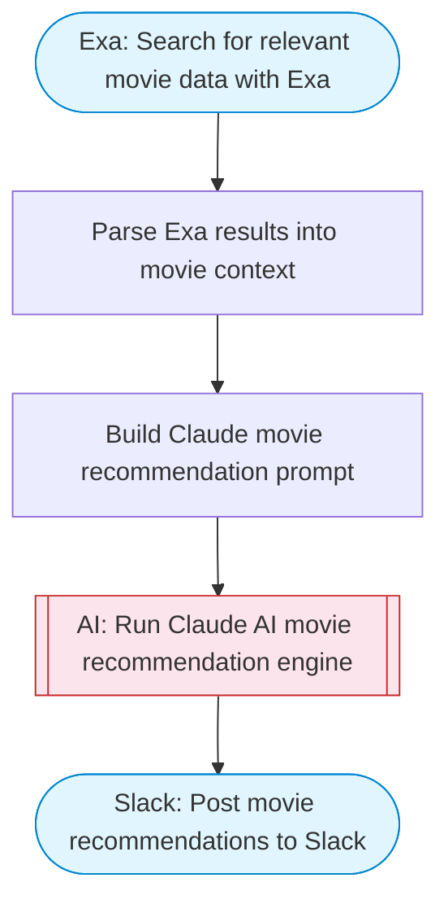

# Movie RAG Chatbot — Exa Search + Claude Recommendations to Slack

Takes a movie preference or question, uses Exa search to find relevant movie data and reviews, uses Claude AI as a recommendation engine to suggest movies with explanations, and posts results to Slack with Block Kit formatting.

> **Works with any AI agent.** Paste this page's URL into Claude Code, Codex, Cursor, Windsurf, OpenClaw, or any coding agent — it will read the docs, connect your platforms, and run this flow for you.

## Quick Start

```bash
# 1. Connect your platforms (one-time setup)
one add exa
one add slack

# 2. Run the flow
one flow execute n8n-2440-movie-rag-chatbot \
  --input slackChannel="C01ABC123" \
  --input query="your question here" \
  --input maxRecommendations="10"
```

## Platforms

| Platform | Used for |
|----------|----------|
| Exa | Movie search |
| Slack | Post movie recommendations to Slack |

> Don't have these connected yet? Run `one list` to check, then `one add <platform>` to connect.

## What it does

1. Search for relevant movie data with Exa
2. Parse Exa results into movie context
3. Build Claude movie recommendation prompt
4. Run Claude AI movie recommendation engine
5. Post movie recommendations to Slack

## Flow diagram



## Inputs

| Input | Required | Description |
|-------|----------|-------------|
| `slackChannel` | Yes | Slack channel ID to post recommendations |
| `query` | Yes | Movie preference or question (e.g. 'A movie about wizards but not Harry Potter' or 'Best sci-fi movies like Blade Runner') |
| `maxRecommendations` | No | Number of movie recommendations to generate (default: 5) |

---

<sub>Based on [n8n #2440](https://n8n.io/workflows/2440) · 36.0K views on n8n · by [mrscoopers](https://n8n.io/creators/mrscoopers) · Converted to One CLI on 2026-03-25</sub>
