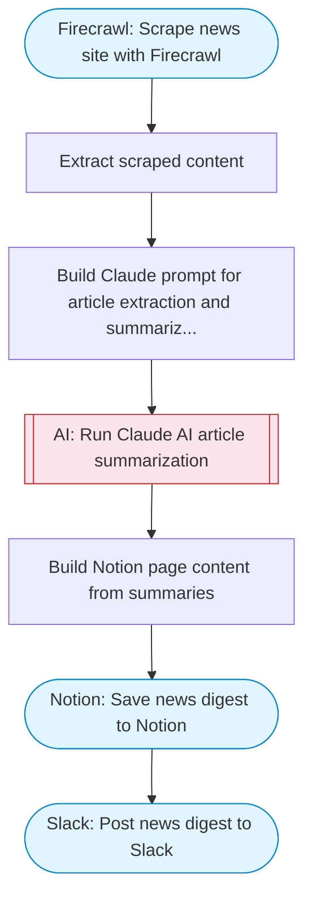

# Scrape and summarize news site posts with AI

Scrapes a news site with Firecrawl, uses Claude AI to extract and summarize articles, and saves structured results to a Notion database. Adapted from n8n's scrape-and-summarize news workflow.

> **Works with any AI agent.** Paste this page's URL into Claude Code, Codex, Cursor, Windsurf, OpenClaw, or any coding agent — it will read the docs, connect your platforms, and run this flow for you.

## Quick Start

```bash
# 1. Connect your platforms (one-time setup)
one add firecrawl
one add notion
one add slack

# 2. Run the flow
one flow execute n8n-2180-news-scraper-summarizer \
  --input slackChannel="C01ABC123" \
  --input newsUrl="https://example.com" \
  --input notionParentPageId="..." \
  --input maxArticles="10"
```

## Platforms

| Platform | Used for |
|----------|----------|
| Firecrawl | Scraping |
| Notion | Saving articles |
| Slack | Digest notification |

> Don't have these connected yet? Run `one list` to check, then `one add <platform>` to connect.

## What it does

1. Scrape news site with Firecrawl
2. Extract scraped content
3. Build Claude prompt for article extraction and summarization
4. Run Claude AI article summarization
5. Build Notion page content from summaries
6. Save news digest to Notion
7. Post news digest to Slack

## Flow diagram



## Inputs

| Input | Required | Description |
|-------|----------|-------------|
| `slackChannel` | Yes | Slack channel ID for news digest |
| `newsUrl` | Yes | URL of the news site to scrape (e.g. 'https://techcrunch.com') |
| `notionParentPageId` | Yes | Notion parent page ID where article summaries will be saved |
| `maxArticles` | No | Maximum number of articles to summarize (default: 10) |

---

<sub>Based on [n8n #2180](https://n8n.io/workflows/2180) · 30.3K views on n8n · by [askans](https://n8n.io/creators/askans) · Converted to One CLI on 2026-03-25</sub>
