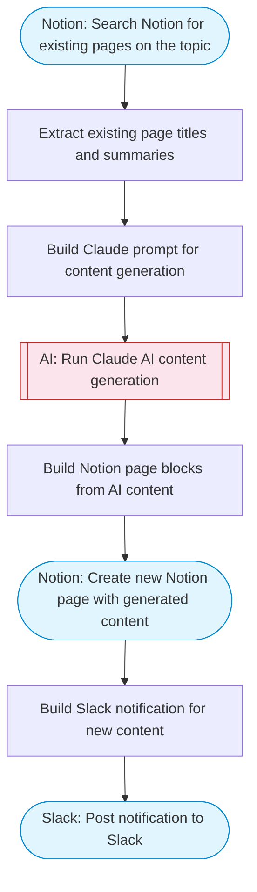

# Notion AI Content Generator

Searches Notion for existing pages on a topic, uses Claude AI to generate new content (articles, documentation, summaries) informed by existing knowledge, and creates a new Notion page with the generated content. Adapted from n8n's Notion AI assistant generator workflow.

> **Works with any AI agent.** Paste this page's URL into Claude Code, Codex, Cursor, Windsurf, OpenClaw, or any coding agent — it will read the docs, connect your platforms, and run this flow for you.

## Quick Start

```bash
# 1. Connect your platforms (one-time setup)
one add notion
one add slack

# 2. Run the flow
one flow execute n8n-2415-notion-ai-content-generator \
  --input notionParentPageId="..." \
  --input topic="your topic here" \
  --input contentType="..." \
  --input tone="..." \
  --input slackChannel="C01ABC123"
```

## Platforms

| Platform | Used for |
|----------|----------|
| Notion | Searching and creating pages |
| Slack | Posting notification |

> Don't have these connected yet? Run `one list` to check, then `one add <platform>` to connect.

## What it does

1. Search Notion for existing pages on the topic
2. Extract existing page titles and summaries
3. Build Claude prompt for content generation
4. Run Claude AI content generation
5. Build Notion page blocks from AI content
6. Create new Notion page with generated content
7. Post notification to Slack

## Flow diagram



## Inputs

| Input | Required | Description |
|-------|----------|-------------|
| `notionParentPageId` | Yes | Notion parent page ID where the new content will be created |
| `topic` | Yes | Topic or title for the content to generate (e.g. 'Onboarding guide for new engineers') |
| `contentType` | No | Type of content to generate: article, documentation, summary, how-to, FAQ (default: article) |
| `tone` | No | Tone of the generated content: professional, casual, technical, friendly (default: professional) |
| `slackChannel` | Yes | Slack channel ID to post the completion notification |

---

<sub>Based on [n8n #2415](https://n8n.io/workflows/2415) · 49.0K views on n8n · by [max-n8n](https://n8n.io/creators/max-n8n) · Converted to One CLI on 2026-03-25</sub>
