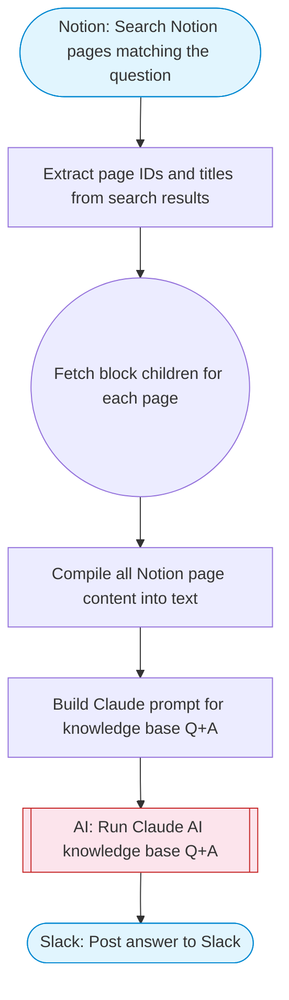

# Notion Knowledge Base AI Assistant

Searches a Notion knowledge base for relevant pages matching a user question, retrieves their content, uses Claude AI to synthesize an accurate answer grounded in the Notion content, and posts the answer to Slack with Block Kit formatting and source citations.

> **Works with any AI agent.** Paste this page's URL into Claude Code, Codex, Cursor, Windsurf, OpenClaw, or any coding agent — it will read the docs, connect your platforms, and run this flow for you.

## Quick Start

```bash
# 1. Connect your platforms (one-time setup)
one add notion
one add slack

# 2. Run the flow
one flow execute n8n-2413-notion-kb-ai-assistant \
  --input question="your question here" \
  --input slackChannel="C01ABC123"
```

## Platforms

| Platform | Used for |
|----------|----------|
| Notion | Searching and reading pages |
| Slack | Posting the answer |

> Don't have these connected yet? Run `one list` to check, then `one add <platform>` to connect.

## What it does

1. Search Notion pages matching the question
2. Extract page IDs and titles from search results
3. Fetch block children for each page
4. Compile all Notion page content into text
5. Build Claude prompt for knowledge base Q&A
6. Run Claude AI knowledge base Q&A
7. Post answer to Slack

## Flow diagram



## Inputs

| Input | Required | Description |
|-------|----------|-------------|
| `question` | Yes | The user's question to answer from the Notion knowledge base |
| `slackChannel` | Yes | Slack channel ID to post the answer |

---

<sub>Based on [n8n #2413](https://n8n.io/workflows/2413) · 50.6K views on n8n · by [max-n8n](https://n8n.io/creators/max-n8n) · Converted to One CLI on 2026-03-25</sub>
