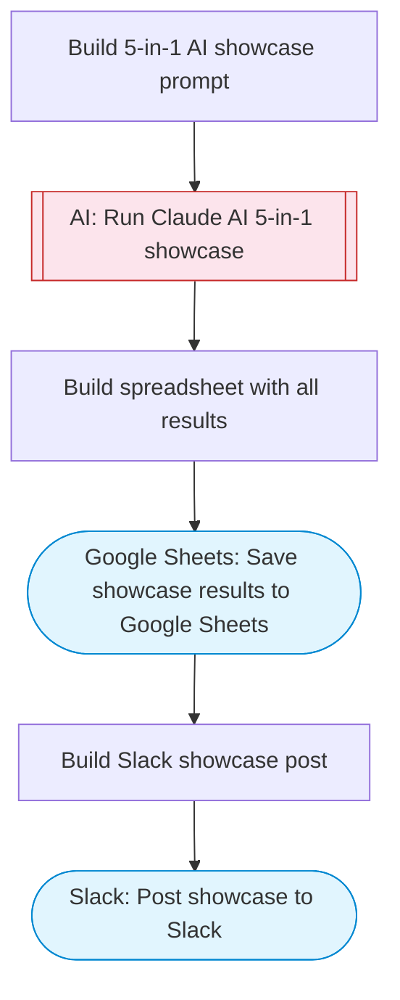

# AI multi-tool showcase: chat, summarize, translate, code, and extract

Demonstrates five AI capabilities in one flow: text chat/Q&A, content summarization, language translation, code generation, and data extraction. Runs all through Claude AI, compiles results, saves to Google Sheets, and posts a showcase to Slack.

> **Works with any AI agent.** Paste this page's URL into Claude Code, Codex, Cursor, Windsurf, OpenClaw, or any coding agent — it will read the docs, connect your platforms, and run this flow for you.

## Quick Start

```bash
# 1. Connect your platforms (one-time setup)
one add google-sheets
one add slack

# 2. Run the flow
one flow execute n8n-1900-openai-examples-5in1 \
  --input slackChannel="C01ABC123" \
  --input chatQuestion="your question here" \
  --input textToSummarize="..." \
  --input translateText="..." \
  --input translateTo="..." \
  --input codeTask="..." \
  --input textToExtract="..."
```

## Platforms

| Platform | Used for |
|----------|----------|
| Google Sheets | Saving results |
| Slack | Posting showcase |

> Don't have these connected yet? Run `one list` to check, then `one add <platform>` to connect.

## What it does

1. Build 5-in-1 AI showcase prompt
2. Run Claude AI 5-in-1 showcase
3. Build spreadsheet with all results
4. Save showcase results to Google Sheets
5. Build Slack showcase post
6. Post showcase to Slack

## Flow diagram



## Inputs

| Input | Required | Description |
|-------|----------|-------------|
| `slackChannel` | Yes | Slack channel for AI showcase results |
| `chatQuestion` | No | Question for the chat/Q&A demo (default: What are the top 3 trends in AI for 2026?) |
| `textToSummarize` | No | Text to summarize (leave empty for a default sample) (default: ) |
| `translateText` | No | Text to translate (default: Hello, how are you today?) |
| `translateTo` | No | Target languages (comma-separated) (default: Spanish, French, Japanese) |
| `codeTask` | No | Programming task for code generation (default: Write a Python function that checks if a string is a palindrome) |
| `textToExtract` | No | Text to extract structured data from (default: ) |

---

<sub>Based on [n8n #1900](https://n8n.io/workflows/1900) · 26.6K views on n8n · by [eduard](https://n8n.io/creators/eduard) · Converted to One CLI on 2026-03-25</sub>
