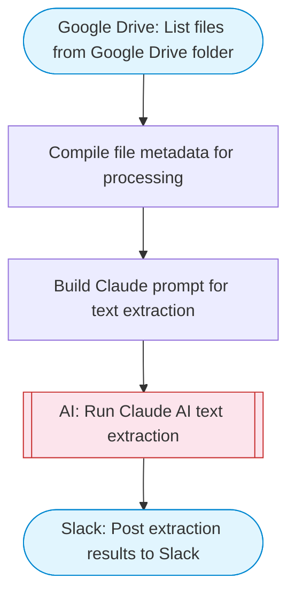

# PDF and image text extraction with AI

Lists files from Google Drive, downloads them, uses Claude AI to extract and structure text from PDFs and images, then posts the structured results to Slack with Block Kit formatting. Adapted from n8n's Vertex AI Gemini text extraction workflow.

> **Works with any AI agent.** Paste this page's URL into Claude Code, Codex, Cursor, Windsurf, OpenClaw, or any coding agent — it will read the docs, connect your platforms, and run this flow for you.

## Quick Start

```bash
# 1. Connect your platforms (one-time setup)
one add google-drive
one add slack

# 2. Run the flow
one flow execute n8n-189-pdf-image-text-extraction \
  --input slackChannel="C01ABC123" \
  --input folderId="..." \
  --input maxFiles="10"
```

## Platforms

| Platform | Used for |
|----------|----------|
| Google Drive | Listing and downloading files |
| Slack | Posting extraction results |

> Don't have these connected yet? Run `one list` to check, then `one add <platform>` to connect.

## What it does

1. List files from Google Drive folder
2. Compile file metadata for processing
3. Build Claude prompt for text extraction
4. Run Claude AI text extraction
5. Post extraction results to Slack

## Flow diagram



## Inputs

| Input | Required | Description |
|-------|----------|-------------|
| `slackChannel` | Yes | Slack channel ID to post the extracted text results |
| `folderId` | Yes | Google Drive folder ID containing PDF and image files to process |
| `maxFiles` | No | Maximum number of files to process (default: 5) (default: 5) |

---

<sub>Based on [n8n #189](https://n8n.io/workflows/189) · 32.6K views on n8n · Converted to One CLI on 2026-03-25</sub>
