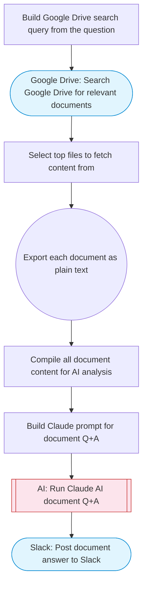

# PDF Document RAG from Google Drive

Searches Google Drive for documents matching a user question, exports their content as plain text, uses Claude AI to synthesize an accurate answer grounded in the document content with citations, and posts the answer to Slack with Block Kit formatting. Adapted from n8n's PDF RAG system with Mistral OCR workflow.

> **Works with any AI agent.** Paste this page's URL into Claude Code, Codex, Cursor, Windsurf, OpenClaw, or any coding agent — it will read the docs, connect your platforms, and run this flow for you.

## Quick Start

```bash
# 1. Connect your platforms (one-time setup)
one add google-drive
one add slack

# 2. Run the flow
one flow execute n8n-4400-pdf-rag-drive \
  --input question="your question here" \
  --input folderId="..." \
  --input slackChannel="C01ABC123"
```

## Platforms

| Platform | Used for |
|----------|----------|
| Google Drive | Searching and reading documents |
| Slack | Posting the answer |

> Don't have these connected yet? Run `one list` to check, then `one add <platform>` to connect.

## What it does

1. Build Google Drive search query from the question
2. Search Google Drive for relevant documents
3. Select top files to fetch content from
4. Export each document as plain text
5. Compile all document content for AI analysis
6. Build Claude prompt for document Q&A
7. Run Claude AI document Q&A
8. Post document answer to Slack

## Flow diagram



## Inputs

| Input | Required | Description |
|-------|----------|-------------|
| `question` | Yes | The question to answer from Google Drive documents |
| `folderId` | No | Google Drive folder ID to search within (optional — searches all files if omitted) (default: ) |
| `slackChannel` | Yes | Slack channel ID to post the answer |

---

<sub>Based on [n8n #4400](https://n8n.io/workflows/4400) · 45.1K views on n8n · by [n3witalia](https://n8n.io/creators/n3witalia) · Converted to One CLI on 2026-03-25</sub>
