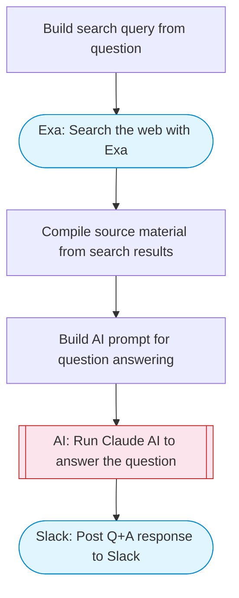

# AI research assistant with Exa web search and Slack Q&A

Takes a question, searches the web with Exa to find authoritative answers, uses Claude AI to synthesize a comprehensive answer with citations, and posts the response to Slack.

> **Works with any AI agent.** Paste this page's URL into Claude Code, Codex, Cursor, Windsurf, OpenClaw, or any coding agent — it will read the docs, connect your platforms, and run this flow for you.

## Quick Start

```bash
# 1. Connect your platforms (one-time setup)
one add exa
one add slack

# 2. Run the flow
one flow execute n8n-2824-perplexity-research-slack \
  --input slackChannel="C01ABC123" \
  --input question="your question here"
```

## Platforms

| Platform | Used for |
|----------|----------|
| Exa | Web search |
| Slack | Posting the answer |

> Don't have these connected yet? Run `one list` to check, then `one add <platform>` to connect.

## What it does

1. Build search query from question
2. Search the web with Exa
3. Compile source material from search results
4. Build AI prompt for question answering
5. Run Claude AI to answer the question
6. Post Q&A response to Slack

## Flow diagram



## Inputs

| Input | Required | Description |
|-------|----------|-------------|
| `slackChannel` | Yes | Slack channel ID for the Q&A response |
| `question` | Yes | Question to research and answer (e.g. 'What are the latest AI regulations in the EU?') |

---

<sub>Based on [n8n #2824](https://n8n.io/workflows/2824) · 24.8K views on n8n · by [n8ninja](https://n8n.io/creators/n8ninja) · Converted to One CLI on 2026-03-25</sub>
