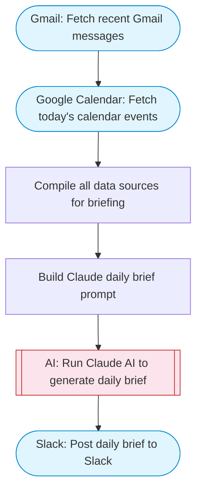

# Personal Assistant — Gmail + Calendar + Sheets daily brief to Slack

Gathers today's Gmail inbox, Google Calendar events, and key data from Sheets, uses Claude AI to generate a personalized daily briefing, and posts it to Slack with Block Kit formatting.

> **Works with any AI agent.** Paste this page's URL into Claude Code, Codex, Cursor, Windsurf, OpenClaw, or any coding agent — it will read the docs, connect your platforms, and run this flow for you.

## Quick Start

```bash
# 1. Connect your platforms (one-time setup)
one add gmail
one add google-calendar
one add google-sheets
one add slack

# 2. Run the flow
one flow execute n8n-3905-personal-assistant \
  --input slackChannel="C01ABC123" \
  --input calendarId="..." \
  --input userName="..."
```

## Platforms

| Platform | Used for |
|----------|----------|
| Gmail | Listing emails |
| Google Calendar | Connection key |
| Google Sheets | Tasks/data |
| Slack | Post daily brief to Slack |

> Don't have these connected yet? Run `one list` to check, then `one add <platform>` to connect.

## What it does

1. Fetch recent Gmail messages
2. Fetch today's calendar events
3. Compile all data sources for briefing
4. Build Claude daily brief prompt
5. Run Claude AI to generate daily brief
6. Post daily brief to Slack

## Flow diagram



## Inputs

| Input | Required | Description |
|-------|----------|-------------|
| `slackChannel` | Yes | Slack channel ID for the daily brief |
| `calendarId` | No | Google Calendar ID (use 'primary' for default) (default: primary) |
| `userName` | No | Your name for personalized greeting (default: there) |

---

<sub>Based on [n8n #3905](https://n8n.io/workflows/3905) · 36.8K views on n8n · by [aitoralonso](https://n8n.io/creators/aitoralonso) · Converted to One CLI on 2026-03-25</sub>
