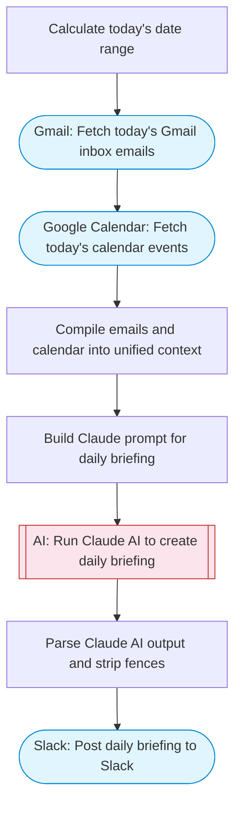

# AI Personal Assistant Daily Briefing

Fetches Gmail inbox and Google Calendar events, uses Claude AI to create a comprehensive daily briefing with priorities, schedule optimization, and action items, then posts to Slack with Block Kit formatting.

> **Works with any AI agent.** Paste this page's URL into Claude Code, Codex, Cursor, Windsurf, OpenClaw, or any coding agent — it will read the docs, connect your platforms, and run this flow for you.

## Quick Start

```bash
# 1. Connect your platforms (one-time setup)
one add gmail
one add google-calendar
one add slack

# 2. Run the flow
one flow execute n8n-4723-personal-assistant \
  --input slackChannel="C01ABC123"
```

## Platforms

| Platform | Used for |
|----------|----------|
| Gmail | Reading emails |
| Google Calendar | Fetching events |
| Slack | Posting the briefing |

> Don't have these connected yet? Run `one list` to check, then `one add <platform>` to connect.

## What it does

1. Calculate today's date range
2. Fetch today's Gmail inbox emails
3. Fetch today's calendar events
4. Compile emails and calendar into unified context
5. Build Claude prompt for daily briefing
6. Run Claude AI to create daily briefing
7. Parse Claude AI output and strip fences
8. Post daily briefing to Slack

## Flow diagram



## Inputs

| Input | Required | Description |
|-------|----------|-------------|
| `slackChannel` | Yes | Slack channel to post the daily briefing |

---

<sub>Based on [n8n #4723](https://n8n.io/workflows/4723) · 82.3K views on n8n · by [maxmitcham](https://n8n.io/creators/maxmitcham) · Converted to One CLI on 2026-03-25</sub>
