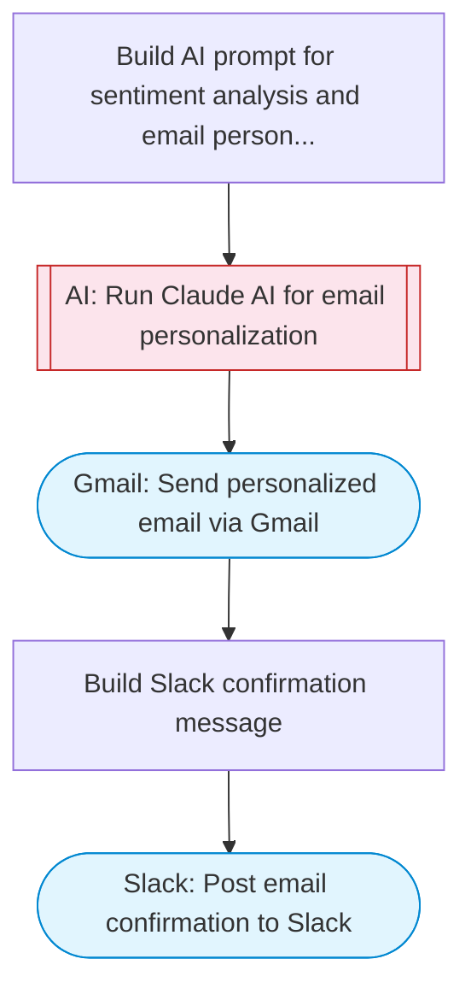

# Personalize marketing emails with AI

Takes customer data (name, product, feedback), uses Claude AI to analyze sentiment and personalize email copy, then sends the personalized marketing email via Gmail.

> **Works with any AI agent.** Paste this page's URL into Claude Code, Codex, Cursor, Windsurf, OpenClaw, or any coding agent — it will read the docs, connect your platforms, and run this flow for you.

## Quick Start

```bash
# 1. Connect your platforms (one-time setup)
one add gmail
one add slack

# 2. Run the flow
one flow execute n8n-3662-personalize-marketing-emails \
  --input slackChannel="C01ABC123" \
  --input customerName="..." \
  --input customerEmail="user@example.com" \
  --input productName="..." \
  --input customerFeedback="..." \
  --input senderName="Alex" \
  --input companyName="..."
```

## Platforms

| Platform | Used for |
|----------|----------|
| Gmail | Sending emails |
| Slack | Status notifications |

> Don't have these connected yet? Run `one list` to check, then `one add <platform>` to connect.

## What it does

1. Build AI prompt for sentiment analysis and email personalization
2. Run Claude AI for email personalization
3. Send personalized email via Gmail
4. Build Slack confirmation message
5. Post email confirmation to Slack

## Flow diagram



## Inputs

| Input | Required | Description |
|-------|----------|-------------|
| `slackChannel` | Yes | Slack channel for email send confirmation |
| `customerName` | Yes | Customer's full name |
| `customerEmail` | Yes | Customer's email address |
| `productName` | Yes | Name of the product the customer purchased |
| `customerFeedback` | Yes | Customer's product feedback or review text |
| `senderName` | No | Name to use in email signature (default: Customer Success Team) |
| `companyName` | No | Company name for branding (default: Our Company) |

---

<sub>Based on [n8n #3662](https://n8n.io/workflows/1978) · 95.7K views on n8n · Converted to One CLI on 2026-03-25</sub>
