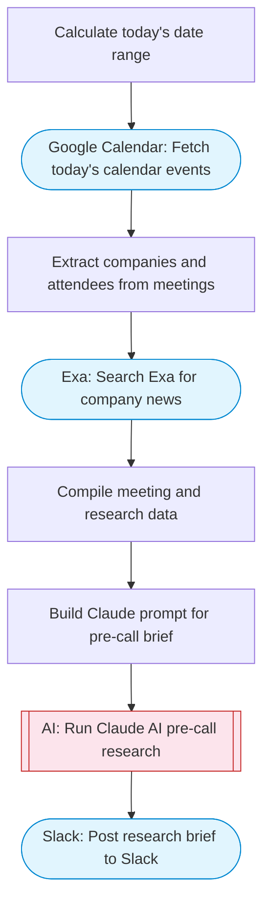

# Pre-Call Research Brief Generator

Fetches today's meetings from Gmail/Calendar, searches Exa for recent company news about meeting attendees, Claude AI creates a comprehensive pre-call research brief, and posts it to Slack with Block Kit formatting.

> **Works with any AI agent.** Paste this page's URL into Claude Code, Codex, Cursor, Windsurf, OpenClaw, or any coding agent — it will read the docs, connect your platforms, and run this flow for you.

## Quick Start

```bash
# 1. Connect your platforms (one-time setup)
one add google-calendar
one add exa
one add slack

# 2. Run the flow
one flow execute n8n-2110-pre-call-research \
  --input slackChannel="C01ABC123" \
  --input companyOverride="..."
```

## Platforms

| Platform | Used for |
|----------|----------|
| Google Calendar | Fetching meetings |
| Exa | Company research |
| Slack | Posting the brief |

> Don't have these connected yet? Run `one list` to check, then `one add <platform>` to connect.

## What it does

1. Calculate today's date range
2. Fetch today's calendar events
3. Extract companies and attendees from meetings
4. Search Exa for company news
5. Compile meeting and research data
6. Build Claude prompt for pre-call brief
7. Run Claude AI pre-call research
8. Post research brief to Slack

## Flow diagram



## Inputs

| Input | Required | Description |
|-------|----------|-------------|
| `slackChannel` | Yes | Slack channel to post the research brief |
| `companyOverride` | No | Optional: specific company to research (overrides calendar extraction) (default: ) |

---

<sub>Based on [n8n #2110](https://n8n.io/workflows/2110) · 67.1K views on n8n · by [n8n_milorad](https://n8n.io/creators/n8n_milorad) · Converted to One CLI on 2026-03-25</sub>
